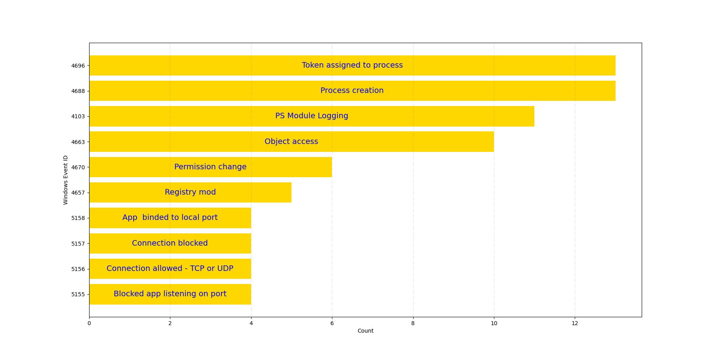
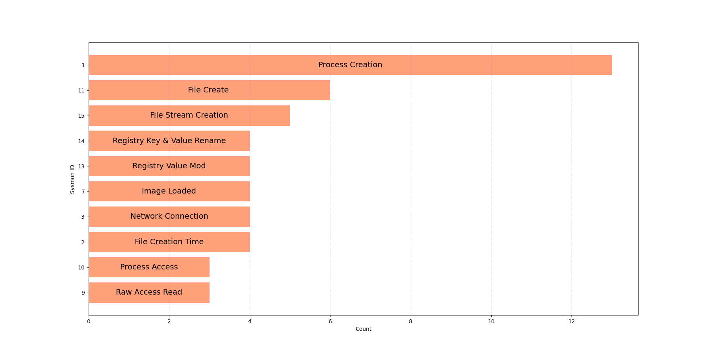

Defenses in Summary
===================
For our report, we included prevention controls from NIST 800-53r5, CAR analytics, and Sysmon and Windows Event Logs from Sensor Mappings to ATT&CK. These preventions and detections are intended to be a starting point for defenders to protect against the top 15 most observed techniques. From NIST, Access Control, System and Information Integrity, and Configuration Management were the main categories. Controls from these families were seen numerous times as preventions for the top 15 techniques and sub-techniques. For CAR mappings, `CAR-2013-04-002: Quick execution of a series of suspicious commands <https://car.mitre.org/analytics/CAR-2013-04-002/>`_ detected 6 out of 15 techniques; `CAR-2013-07-001: Suspicious Arguments <https://car.mitre.org/analytics/CAR-2013-07-001/>`_ detected 3 out of 15 techniques; and `CAR-2014-11-004: Remote PowerShell Sessions <https://car.mitre.org/analytics/CAR-2014-11-004/>`_ detected 2 out of 15 techniques. Out of all CAR analytics, applying these three would provide the best return on investment (ROI).

For Windows event logs, there are numerous helpful event IDs for each technique. The top event IDs focus on process creation (4688), assigning process tokens (4696), and logging PowerShell activities (4103).  

   Coverage of the Top 10 Windows Event IDs.

The top Sysmon IDs focus on process creation (1), file creation (11), and named file stream creation (15). Interestingly, the top Sysmon ID (1) and the top Winevtx event ID (4688) focus on monitoring process creation.

   Coverage of the Top 10 Sysmon IDs.

There are other detections that we were not able to include in this paper but want to highlight for defenders. `Sigma <https://github.com/SigmaHQ/sigma/tree/master>`_ provides numerous detection rules, based on operating system or platform. However, many rules are experimental and need to be tuned to prevent false positives. There are also tools to convert Sigma rules into different formats, such as `sigconverter.io <https://sigconverter.io/>`_ or `Sigma Command Line Interface <https://github.com/SigmaHQ/sigma-cli>`_. MITRE’s CAR repository also includes a `comparison chart <https://car.mitre.org/coverage/>`_ for each ATT&CK technique, showing its coverage by CAR, Sigma, Elastic Detection (ES), and Splunk rules. It provides links to each repository for defenders to quickly identify relevant detections by technique/sub-technique. In addition to Sysmon and WinEvtx, `Sensor Mappings to ATT&CK <https://github.com/center-for-threat-informed-defense/sensor-mappings-to-attack/tree/main/mappings/input/enterprise/csv>`_ includes mappings for Auditd, CloudTrail, OSQuery, and Zeek. While we were only able to include WinEvtx and Sysmon in our report, we encourage defenders to visit the `project’s website <https://center-for-threat-informed-defense.github.io/sensor-mappings-to-attack/>`_ for a complete list of all mappings.

To identify which prevention and detection methods are needed in their environment, defenders can use the Sightings data to assess their current security products and inform their security strategy. With ATT&CK Navigator, defenders can document what techniques they can detect and how they prioritize those detections. Resources, such as the Center’s Adversary Emulation Library, MITRE’s CALDERA platform, or Red Canary’s Atomic Red Team library, can test an organization’s defenses and detections on a recurring basis. These libraries contain tests for the specific adversary behaviors observed in our Sightings dataset. These resources, and others, allow defenders to identify coverage gaps and test their tools against the top 15 techniques observed in the wild. This section is not intended to be a comprehensive list of tools for defenders, but it should provide a useful starting point.  