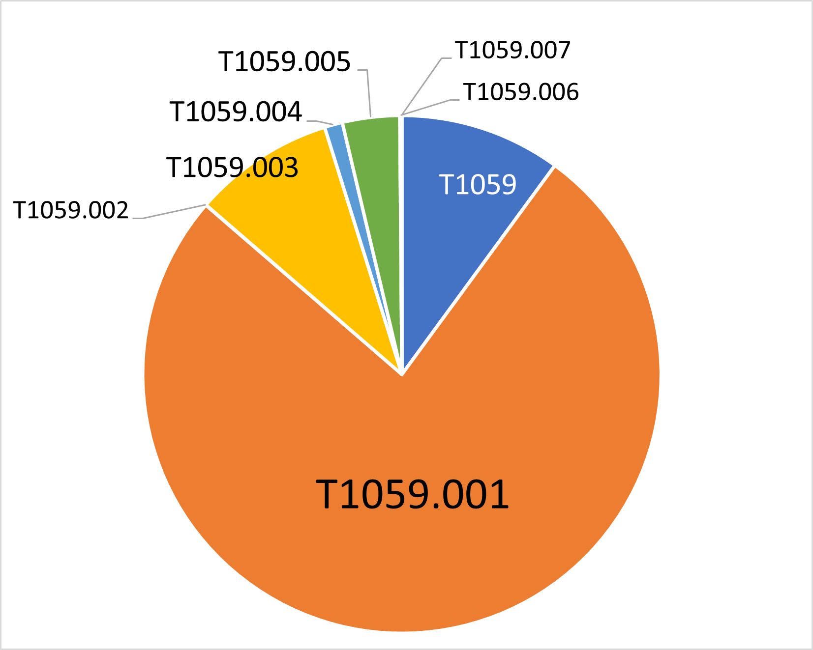
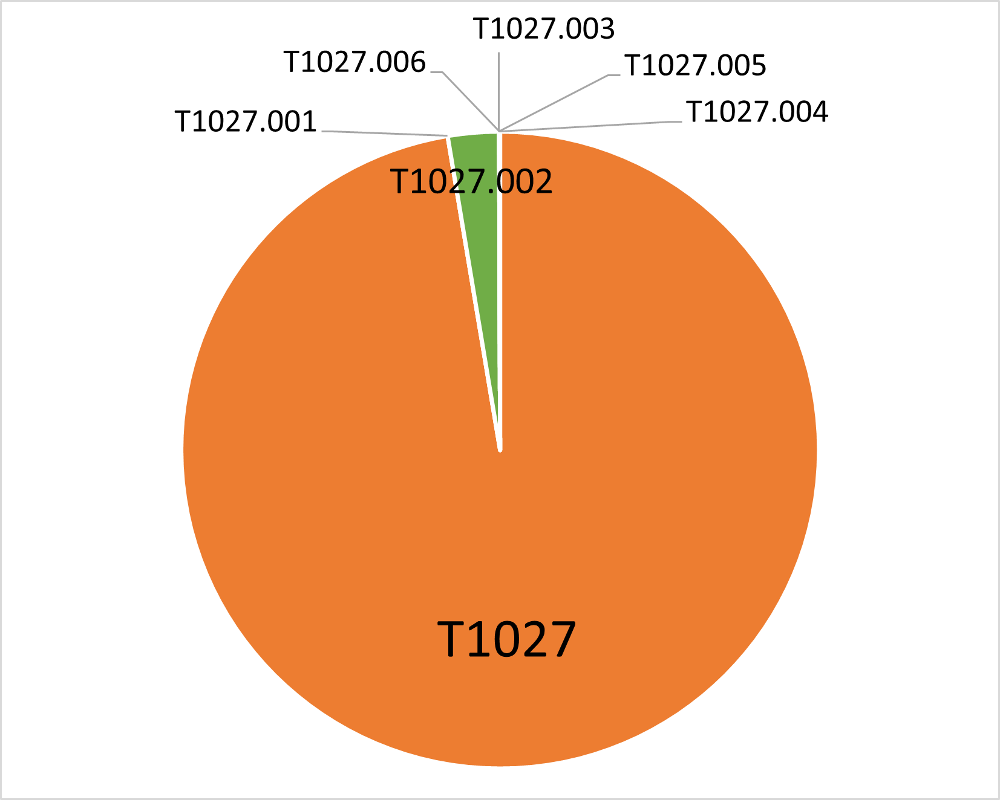
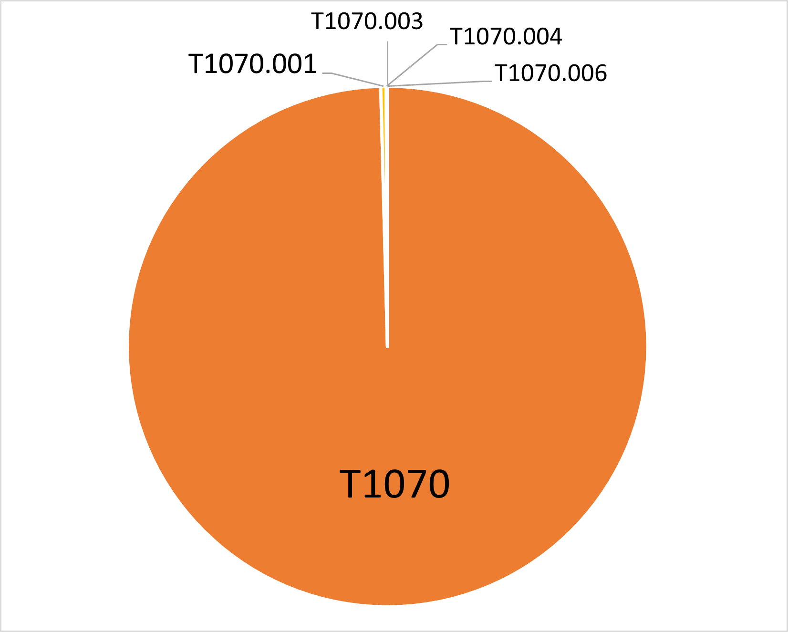
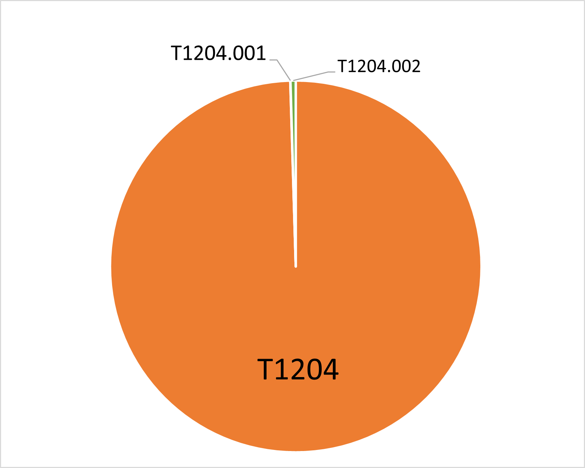

Top 15 Techniques
##################

The following is a more in-depth review of the top 15 most observed techniques. If a technique has sub-techniques in the ATT&CK framework, then we divided it into its sub-techniques; however, we only focused on the sub-techniques seen in our data. This provides more granular glimpse into each technique for defenders. The majority of the top 15 techniques abuse legitimate system tools. This underscores the idea that adversaries are attempting to appear as legitimate users. 
We have incorporated prevention methods from the `Center’s mappings <https://mitre-engenuity.org/cybersecurity/center-for-threat-informed-defense/our-work/nist-800-53-control-mappings/>`_ of ATT&CK to the `NIST SP 800-53 <https://nvlpubs.nist.gov/nistpubs/SpecialPublications/NIST.SP.800-53r5.pdf/>`_ and detection methods from the `Cyber Analytics Repository <https://car.mitre.org/analytics/>`_ and the Center’s `Sensor Mappings for ATT&CK <https://mitre-engenuity.org/cybersecurity/center-for-threat-informed-defense/our-work/sensor-mappings-to-attack/>`_, which connects conceptual data sources to sensors and other tools . Due to the number of Windows events in our data, we chose to focus on sensor mappings for Sysmon and Windows event logs (WinEvtx). Overall, several prevention and detection controls focused on creating strong baselines, restricting permissions, and refining logs for process creation to detect and disrupt adversary behaviors.

1. Command and Scripting Interpreter `[T1059] <https://attack.mitre.org/techniques/T1059/>`_
***********************************************
Description
-----------

Command and Scripting Interpreter is a commonly used living-off-the-land technique. Most platforms have built-in command-line interfaces or scripting capabilities, allowing adversaries to use them for executing arbitrary commands, scripts, or binaries.

Overall, T1059 was the most sighted technique in our data, in part because we normalized our data, which included T1064 and T1086 from previous ATT&CK versions, to T1059. The overwhelming majority of the sightings came from PowerShell `(T1059.001) <https://attack.mitre.org/techniques/T1059/001/>`_. This is not surprising as it is a common tool used by adversaries for its ubiquity, versatility, and ability to obfuscate activity. The second most observed sub-technique the Windows Command Shell `(T1059.003) <https://attack.mitre.org/techniques/T1059/003/>`_, which is similarly unsurprising for its ubiquity in Windows environments. The following sub-techniques comprise less than 5% of T1059 sightings: 

* Visual Basic `(T1059.005) <https://attack.mitre.org/techniques/T1059/005/>`_ 
* Unix Shell `(T1059.004) <https://attack.mitre.org/techniques/T1059/004/>`_ 
* Python `(T1059.006) <https://attack.mitre.org/techniques/T1059/006/>`_ 
* JavaScript `(T1059.007) <https://attack.mitre.org/techniques/T1059/007/>`_
* AppleScript `(T1059.002) <https://attack.mitre.org/techniques/T1059/002/>`_ 

While these techniques are not difficult to monitor for, they are regularly used by benign programs, which could cause false positives for defenders to investigate. 

T1059 was evenly distributed between user and SYSTEM level privileges. It followed the overall data trends, with the US as the top region, Windows as the top platform, Manufacturing as the top sector, and Heodo (another name for Emotet) as the top software.

Prevention
----------
NIST lists 24 security controls to mitigate Command and Script Interpreter:

* AC-2 Account Management (Also mitigates PowerShell, AppleScript, Visual Basic, Windows Command Shell, Unix Shell, Python, JavaScript)
* AC-3 Access Enforcement (Also mitigates PowerShell, AppleScript, Visual Basic, Windows Command Shell, Unix Shell, Python, JavaScript)
* AC-5 Separation of Duties (Also mitigates PowerShell)
* AC-6 Least Privilege (Also mitigates PowerShell, AppleScript, Visual Basic, Windows Command Shell, Unix Shell, Python, JavaScript)
* AC-17 Remote Access (Also mitigates PowerShell, AppleScript, Visual Basic, Windows Command Shell, Unix Shell, Python, JavaScript)
* CA-7 Continuous Monitoring (Also mitigates Visual Basic and JavaScript)
* CA-8 Penetration Testing 
* CM-2 Baseline Configuration (Also mitigates PowerShell, AppleScript, Visual Basic, Windows Command Shell, Unix Shell, Python, JavaScript)
* CM-5 Access Restrictions for Change (Also mitigates PowerShell and Python)
* CM-6 Configuration Settings (Also mitigates PowerShell, AppleScript, Visual Basic, Windows Command Shell, Unix Shell, Python, JavaScript)
* CM-7 Least Functionality (Also mitigates Visual Basic and JavaScript)
* CM-8 System Component Inventory (Also mitigates PowerShell, Visual Basic, JavaScript)
* CM-11 User-Installed Software (Also mitigates Python)
* IA -2 Identification and Authentication (organizational Users) (Also mitigates PowerShell)
* IA-8 Identification and Authentication (non-organizational Users) (Also mitigates PowerShell)
* IA-9 Service Identification and Authentication (Also mitigates PowerShell and AppleScript)
* RA-5 Vulnerability Monitoring and Scanning (Also mitigates PowerShell, Visual Basic, and JavaScript)
* SC-18 Mobile Code (Also mitigates Visual Basic and JavaScript)
* SI-2 Flaw Remediation (Also mitigates PowerShell, Visual Basic, Python)
* SI-3 Malicious Code Protection (Also mitigates PowerShell, AppleScript, Visual Basic, Windows Command Shell, Unix Shell, Python, JavaScript)
* SI-4 System Monitoring (Also mitigates PowerShell, AppleScript, Visual Basic, Windows Command Shell, Unix Shell, Python, JavaScript)
* SI-7 Software, Firmware, and Information Integrity (Also mitigates PowerShell, AppleScript, Visual Basic, Windows Command Shell, Unix Shell, Python, JavaScript)
* SI-10 Information Input Validation (Also mitigates PowerShell, AppleScript, Visual Basic, Windows Command Shell, Unix Shell, Python, JavaScript)
* SI-16 Memory Protection (Also mitigates PowerShell, AppleScript, Visual Basic, Windows Command Shell, Unix Shell, Python, JavaScript)

NIST lists 1 security controls to mitigate Python:

* CM-3 Configuration Change Control

NIST lists 4 security controls to mitigate AppleScript:

* SR-4 Provenance
* SR-5 Acquisition Strategies, Tools, and Methods
* SR-6 Supplier Assessments and Reviews
* SR-11 Component Authenticity

Detections
----------
CAR 
^^^
Rules for the core technique: 

* `CAR-2021-01-002: Unusually Long Command Line Strings <https://car.mitre.org/analytics/CAR-2021-01-002/>`_ 

Rules for PowerShell: 

* `CAR-2014-04-003: PowerShell Execution <hhttps://car.mitre.org/analytics/CAR-2014-04-003/>`_ 
* `CAR-2014-11-004: Remote PowerShell Sessions <https://car.mitre.org/analytics/CAR-2014-11-004/>`_ 

Rules for Windows Command Shell:

* `CAR-2013-02-003: Processes Spawning cmd.exe <https://car.mitre.org/analytics/CAR-2013-02-003/>`_
* `CAR-2014-11-002: Outlier Parents of Cmd <https://car.mitre.org/analytics/CAR-2014-11-002/>`_

Rules for Visual Basic:

* `CAR-2013-04-002: Quick execution of a series of suspicious commands <https://car.mitre.org/analytics/CAR-2013-04-002/>`_

Sensor Mappings for ATT&CK 
^^^^^^^^^^^^^^^^^^^^^^^^^^
.. list-table::
  :widths: 20 50
  :header-rows: 0

  * - **Sysmon**
    - 1, 7, 30 

  * - **Winevtx**
    - 4103, 4104, 4688, 4696 

2. Obfuscated Files or Information `[T1027] <https://attack.mitre.org/techniques/T1027/>`_
***********************************************
Description
-----------

Adversaries may encrypt, encode, or otherwise obfuscate payloads, files, scripts, or commands to avoid detection. Attackers can use T1027 to compress, archive, encrypt, or split payloads into multiple files; password protect or encode portions of files; or obfuscate commands in scripts. T1027 is often combined with Deobfuscate/Decode Files or Information `(T1140) <https://attack.mitre.org/techniques/T1140/>`_, User Execution `(T1204) <https://attack.mitre.org/techniques/T1204//>`_, Command and Scripting Interpreter `(T1059) <https://attack.mitre.org/techniques/T1059/>`_, and others depending on how obfuscation was used during the attack.

A majority of T1027 did not include sub-techniques. This is likely due in part to normalizing our data, which included T1045 and T1066 from previous ATT&CK versions, to T1027. The most observed sub-technique was Software Packing `(T1027.002) <https://attack.mitre.org/techniques/T1027/002/>`_. Adversaries use this sub-technique to evade detection of their code, particularly from signature-based detections. We also saw a small amount of the following sub-techniques:
* HTML Smuggling `(T1027.006) <https://attack.mitre.org/techniques/T1027/006/>`_ 
* Binary Padding `(T1027.001) <https://attack.mitre.org/techniques/T1027/001/>`_ 
* Steganography `(T1027.003) <https://attack.mitre.org/techniques/T1027/003/>`_ 
* Compile After Delivery `(T1027.004) <https://attack.mitre.org/techniques/T1027/004/>`_ 
* Indicator Removal from Tools `(T1027.005) <https://attack.mitre.org/techniques/T1027/005/>`_

T1027 was evenly distributed between different software. It followed the overall data trends, with the US as the top region, Windows as the top platform, and Manufacturing as the top sector. Notably, it deviated from the overall privilege level trend, with more SYSTEM level permissions seen.

Prevention
----------
NIST lists 6 security controls to mitigate Obfuscated Files or Information:

* CM-2 Baseline Configuration 
* CM-6 Configuration Settings
* SI-2 Flaw Remediation (Also mitigates Software Packing)
* SI-3 Malicious Code Protection (Also mitigates Software Packing)
* SI-4 System Monitoring (Also mitigates Software Packing)
* SI-7 Software, Firmware, and Information Integrity (Also mitigates Software Packing)

Detections
----------
CAR 
^^^
None

Sensor Mappings for ATT&CK 
^^^^^^^^^^^^^^^^^^^^^^^^^^
.. list-table::
  :widths: 20 50
  :header-rows: 0

  * - **Sysmon**
    - 1, 11, 12, 15, 19, 20, 7 

  * - **Winevtx**
    - 4103, 4104, 4657, 4663, 4664, 4688, 4696, 5857, 5858, 5859, 5860, 5861

3. Ingress Tool Transfer `[T1105] <https://attack.mitre.org/techniques/T1105/>`_
***********************************************
Description
-----------

Adversaries may transfer tools or other files from a command-and-control system into a compromised environment. They can conduct living-of-the-land attacks using native utilities or installers and package managers in Windows, Linux, and macOS systems to download files. Adversaries can also download files through Cloud-based services, such as Dropbox or OneDrive, that sync with the targeted systems.

Nearly all instances of this technique came from the US on Windows-based systems, with SYSTEM or user-level privileges, in the Manufacturing or Administrative and Support and Waste Management and Remediation Services sectors. T1105 was distributed evenly across different software. Given this technique’s high occurrence, it is notable that it was not reported at higher rates in other sectors or with administrative level privileges. 

Prevention
----------
NIST lists 8 security controls to mitigate Ingress Tool Transfer:

* AC-4 Information Flow Enforcement
* CA-7 Continuous Monitoring
* CM-2 Baseline Configuration
* CM-6 Configuration Settings
* CM-7 Least Functionality
* SC-7 Boundary Protection
* SI-3 Malicious Code Protection
* SI-4 System Monitoring

Detections
----------
CAR 
^^^
Rules for the core technique:

* `CAR-2013-07-001: Suspicious Arguments <https://car.mitre.org/analytics/CAR-2013-07-001/>`_
* `CAR-2021-05-005: BITSAdmin Download File <https://car.mitre.org/analytics/CAR-2021-05-005/>`_
* `CAR-2021-05-006: CertUtil Download With URLCache and Split Arguments <https://car.mitre.org/analytics/CAR-2021-05-006/>`_
* `CAR-2021-05-007: CertUtil Download With VerifyCtl and Split Arguments <https://car.mitre.org/analytics/CAR-2021-05-007/>`_

Sensor Mappings for ATT&CK 
^^^^^^^^^^^^^^^^^^^^^^^^^^
.. list-table::
  :widths: 20 50
  :header-rows: 0

  * - **Sysmon**
    - 11, 15, 3 

  * - **Winevtx**
    - 4663, 5031, 5154, 5155, 5156, 5157, 5158, 5159

4. Modify Registry `[T1112] <https://attack.mitre.org/techniques/T1112/>`_
***********************************************
Description
-----------

Adversaries may use built-in command line tools or the Win32 API to interact with the Windows Registry to hide configuration information, remove information, or as part of other techniques for Execution and Persistence. Specific areas of the registry depend on account permissions to access, potentially requiring adversaries to gain administrator-level privileges to modify. The Windows registry is a significant component of Windows, making it an attractive tool for adversaries to use.

T1112 sightings occur on Windows-based platforms and were evenly distributed across different countries, sectors, and software. We lacked a meaningful amount of data for privilege level analysis. Overall, we received significantly more sightings of T1112 in 2023 than in 2022; this could be due to attackers using this technique more frequently during their operations. However, the registry has been a common attack vector for years, so this sudden increase in Sightings is likely due to statistical noise.
 

Prevention
----------
NIST lists 2 security controls to mitigate Modify Registry: 

* AC-6 Least Privilege
* CM-7 Least Functionality

Detections
----------
CAR 
^^^
Rules for core technique:

* `CAR-2013-01-002: Autorun Differences <https://car.mitre.org/analytics/CAR-2013-01-002/>`_
* `CAR-2013-03-001: Reg.exe called from Command Shell <https://car.mitre.org/analytics/CAR-2013-03-001/>`_
* `CAR-2013-04-002: Quick execution of a series of suspicious commands <https://car.mitre.org/analytics/CAR-2013-04-002/>`_
* `CAR-2014-11-005: Remote Registry <https://car.mitre.org/analytics/CAR-2014-11-005/>`_
* `CAR-2020-05-003: Rare LolBAS Command Lines <https://car.mitre.org/analytics/CAR-2020-05-003/>`_
* `CAR-2021-11-001: Registry Edit with Creation of SafeDllSearchMode Key Set to 0 <https://car.mitre.org/analytics/CAR-2021-11-001/>`_
* `CAR-2021-11-002: Registry Edit with Modification of Userinit, Shell, or Notify <https://car.mitre.org/analytics/CAR-2021-11-002/>`_
* `CAR-2021-12-002: Modification of Default Startup Folder in the Registry Key ‘Common Startup’ <https://car.mitre.org/analytics/CAR-2021-12-002/>`_

Sensor Mappings for ATT&CK 
^^^^^^^^^^^^^^^^^^^^^^^^^^
.. list-table::
  :widths: 20 50
  :header-rows: 0

  * - **Sysmon**
    - 1, 12, 13, 14 

  * - **Winevtx**
    - 4103, 4657, 4660, 4670, 4688, 4696

5. Indicator Removal `[T1070] <https://attack.mitre.org/techniques/T1070/>`_
***********************************************
Description
-----------

Various platform-specific artifacts may be created by an adversary or expose an adversary’s actions. Adversaries may delete or modify these artifacts to remove any evidence of their presence or hinder defenses. Because these artifacts are used during forensic and incident response efforts, their removal could impede an investigation or lengthen the intrusion detection process.

A majority of T1070 did not include sub-techniques. This is likely due in part to normalizing our data, which included T1099 and T1107 from previous ATT&CK versions, to T1070. The following sub-techniques comprise less than 1% of T1070 sightings: 

* Clear Windows Event Logs `(T1070.001) <https://attack.mitre.org/techniques/T1070/001/>`_ 
* File Deletion `(T1070.004) <https://attack.mitre.org/techniques/T1070/004/>`_ 
* Clear Command History `(T1070.003) <https://attack.mitre.org/techniques/T1070/003/>`_ 
* Timestomp `(T1070.006) <https://attack.mitre.org/techniques/T1070/006/>`_ 

T1070 occurred mostly on Windows-based platforms and was distributed evenly across different countries and sectors. Only a small sub-set of sightings contained privilege levels and software information. However, it followed the overall data trend, with user-level permissions and Heodo being the most observed privilege levels and software, respectively.
 
Prevention
----------
NIST lists 21 security controls to mitigate Indicator Removal: 

* AC-2 Account Management (Also mitigates Clear Windows Event Logs and Clear Command History)
* AC-3 Access Enforcement (Also mitigates Clear Windows Event Logs and Clear Command History)
* AC-5 Separation of Duties (Also mitigates Clear Windows Event Logs and Clear Command History)
* AC-6 Least Privilege (Also mitigates Clear Windows Event Logs and Clear Command History)
* AC-16 Security and Privacy Attributes (Also mitigates Clear Windows Event Logs)
* AC-17 Remote Access (Also mitigates Clear Windows Event Logs)
* AC-18 Wireless Access (Also mitigates Clear Windows Event Logs)
* AC-19 Access Control for Mobile Devices (Also mitigates Clear Windows Event Logs)
* CA-7 Continuous Monitoring (Also mitigates Clear Windows Event Logs and Clear Command History)
* CM-2 Baseline Configuration (Also mitigates Clear Windows Event Logs and Clear Command History)
* CM-6 Configuration Settings (Also mitigates Clear Windows Event Logs and Clear Command History)
* CP-6 Alternate Storage Site (Also mitigates Clear Windows Event Logs)
* CP-7 Alternate Processing Site (Also mitigates Clear Windows Event Logs)
* CP-9 System Backup (Also mitigates Clear Windows Event Logs)
* SC-4 Information in Shared System Resources (Also mitigates Clear Windows Event Logs)
* SC-36 Distributed Processing and Storage (Also mitigates Clear Windows Event Logs)
* SI-3 Malicious Code Protection (Also mitigates Clear Windows Event Logs and Clear Command History)
* SI-4 System Monitoring (Also mitigates Clear Windows Event Logs and Clear Command History)
* SI-7 Software, Firmware, and Information Integrity (Also mitigates Clear Windows Event Logs and Clear Command History)
* SI-12 Information Management and Retention (Also mitigates Clear Windows Event Logs)
* SI-23 Information Fragmentation (Also mitigates Clear Windows Event Logs)

Detections
----------
CAR 
^^^
Rules for Clear Windows Event Logs:

* `CAR-2016-04-002: User Activity from Clearing Event Logs <https://car.mitre.org/analytics/CAR-2016-04-002/>`_
* `CAR-2021-01-003: Clearing Windows Logs with Wevtutil <https://car.mitre.org/analytics/CAR-2021-01-003/>`_

Rules for Clear Command History:

* `CAR-2020-11-005: Clear Powershell Console Command History <https://car.mitre.org/analytics/CAR-2020-11-005/>`_

Sensor Mappings for ATT&CK 
^^^^^^^^^^^^^^^^^^^^^^^^^^
.. list-table::
  :widths: 20 50
  :header-rows: 0

  * - **Sysmon**
    - 1, 12, 13, 14, 2, 23, 26

  * - **Winevtx**
    - 2004, 2005, 2006, 2033, 4103, 4625, 4648, 4657, 4660, 4663, 4664, 4670, 4688, 4696, 4700, 4701, 4702, 4726, 4743, 4776, 4946, 4947, 4948

6. User Execution `[T1204] <https://attack.mitre.org/techniques/T1204/>`_
***********************************************
Description
-----------

An adversary may rely upon user actions to gain Initial Access or execute malicious software on a system. Common examples of user execution include phishing and social engineering attacks. Adversaries may send a malicious link, file, or image for a user to open or deceive users into enabling Remote Access Software to give them direct control of the system. 

A majority of sightings did not contain a sub-technique. Less than 1% contained Malicious Link `(T1204.001) <https://attack.mitre.org/techniques/T1204/001/>`_ and Malicious File `(T1204.002) <https://attack.mitre.org/techniques/T1204/002/>`_. Most sightings occurred on Windows-based systems and were almost evenly distributed across countries and sectors. Only a small sub-set included privilege level information and software, with user level privileges and Cobalt Strike seen the most frequently. 
 

Prevention
----------
NIST lists 13 security controls to mitigate Indicator Removal: 

* AC-4 Information Flow Enforcement (Also mitigates Malicious Link and Malicious File)
* CA-7 Continuous Monitoring (Also mitigates Malicious Link and Malicious File)
* CM-2 Baseline Configuration (Also mitigates Malicious Link and Malicious File)
* CM-6 Configuration Settings (Also mitigates Malicious Link and Malicious File)
* CM-7 Least Functionality (Also mitigates Malicious File)
* SC-7 Boundary Protection (Also mitigates Malicious Link and Malicious File)
* SC-44 Detonation Chambers (Also mitigates Malicious Link and Malicious File)
* SI-2 Flaw Remediation (Also mitigates Malicious Link)
* SI-3 Malicious Code Protection (Also mitigates Malicious Link and Malicious File)
* SI-4 System Monitoring (Also mitigates Malicious Link and Malicious File)
* SI-7 Software, Firmware, and Information Integrity (Also mitigates Malicious File)
* SI-8 Spam Protection (Also mitigates Malicious Link and Malicious File)
* SI-10 Information Input Validation (Also mitigates Malicious File)

Detections
----------
CAR 
^^^
Rules for Malicious File:

* `CAR-2021-05-002: Batch File Write to System32 <https://car.mitre.org/analytics/CAR-2021-05-002/>`_

Sensor Mappings for ATT&CK 
^^^^^^^^^^^^^^^^^^^^^^^^^^
.. list-table::
  :widths: 20 50
  :header-rows: 0

  * - **Sysmon**
    - 1, 11, 15, 3

  * - **Winevtx**
    - 4103, 4663, 4688, 4696, 5031, 5154, 5155, 5156, 5157, 5158, 5159