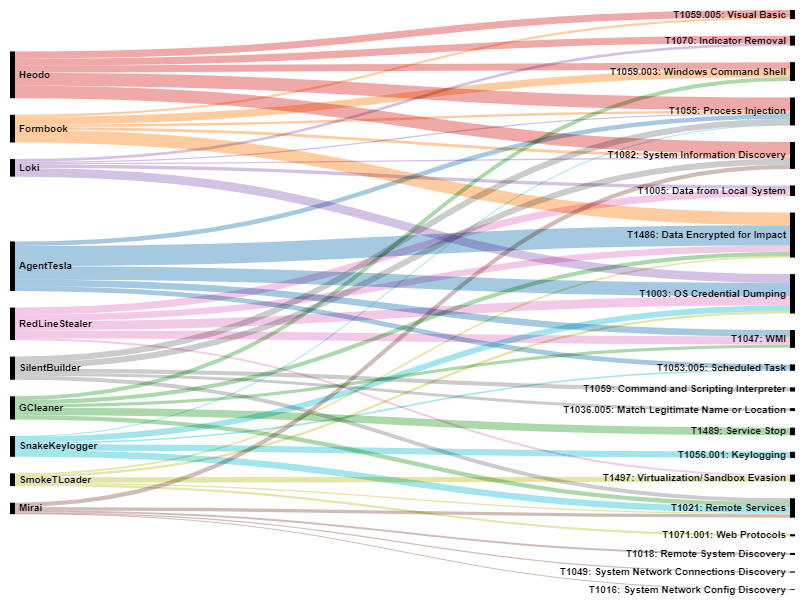
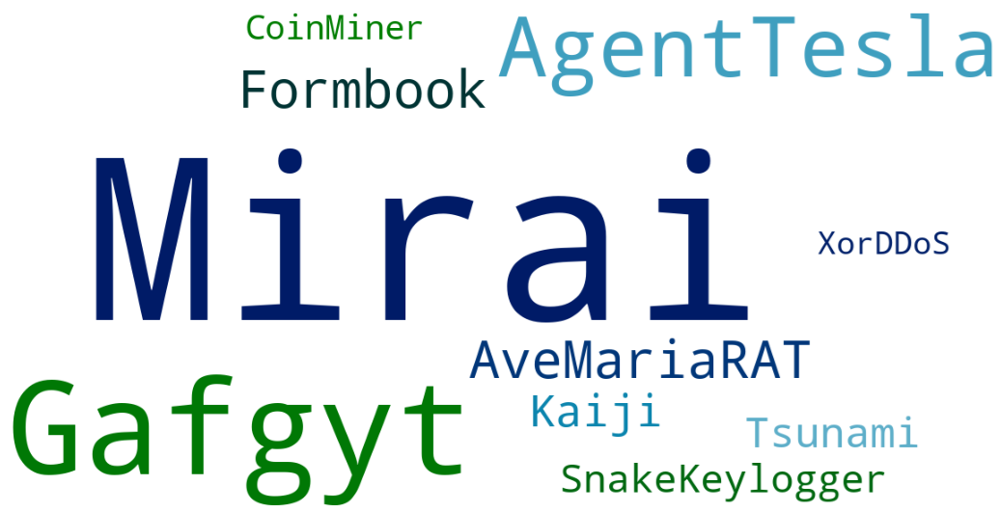
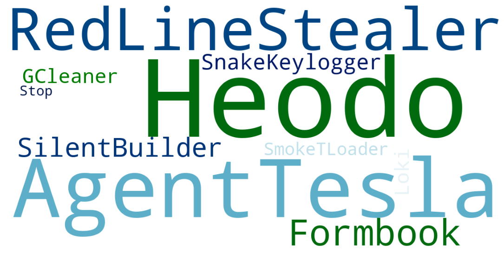
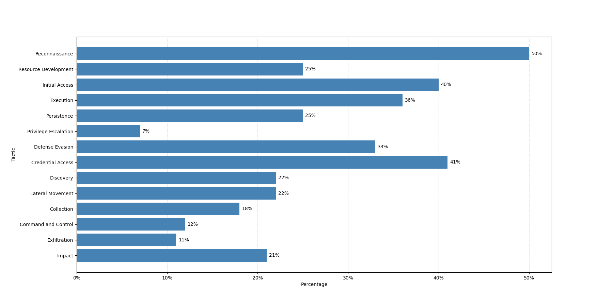

Additional Analysis
===================

Top 15 Techniques by Year
**************************

.. figure:: _static/Top_15_TID_over_time_new.png
   :alt: Top 15 Techniques over Time.
   :align: center
   :width: 100%

   Techniques by Year. (Click to enlarge)

By reviewing the top 15 techniques across the entire timeline, we can use frequency
analysis to identify any patterns or anomalies. Note from the figure that there are abrupt increases in our
sightings at different times throughout the 26 months. We do not have enough information
to know definitively why these spikes occurred. It could be due to an increase of
attacks in the wild, or a modified detection capability that suddenly started finding
and reporting new techniques. Nearly 80% of our data is raw, meaning it has not been
validated by a human. Any misconfigurations or adjusted configurations could result in a
data surge.

We also noted changes in the top technique over time. T1059 dominated the top spot until
2023, when T1112 became the most reported technique. These are unsurprising given their
ranking in our top 15 techniques. `T1059 – Command and Scripting Interpreter
<https://attack.mitre.org/techniques/T1059>`__ and `T1112 – Modify Registry
<https://attack.mitre.org/techniques/T1112>`__ are extremely common techniques used by
attackers. However, it is unusual that these techniques are part of our data surges. For T1059, it was
consistently reported prior to these increases, so a configuration change would likely
not be the cause for a sudden increase in sightings. Instead, this technique may have
truly been seen more frequently in the wild during these times, or perhaps Sightings
received data from additional contributors, causing our sightings to spike. For T1112,
we did not have significant reporting of this technique prior to the data surge at the
beginning of 2023. This could also be due to its more frequent use in the wild or
changes in defense configurations. To truly know why we have these sudden increases, we
will have to collaborate more closely with our data contributors.

Sectors
*******

The sectors within our data are labeled with the corresponding North American Industry
Classification System (NAICS) codes. NAICS organizes sectors into the following
categories:

* Agriculture, Forestry, Fishing, and Hunting
* Mining, Quarrying, and Oil and Gas Extraction
* Utilities
* Construction
* Manufacturing
* Wholesale Trade
* Retail Trade
* Transportation and Warehousing
* Information
* Finance and Insurance
* Real Estate and Rental and Leasing
* Professional, Scientific, and Technical Services
* Management of Companies and Enterprises
* Administrative and Support and Waste Management and Remediation Services
* Educational Services
* Health Care and Social Assistance
* Arts, Entertainment, and Recreation
* Accommodation and Food Services
* Other Services (except Public Administration)
* Public Administration

Overall, nearly 25% of sightings occurred within the Manufacturing sector, which was
twice as much as the next most frequently seen sector. There are also 4 sectors that are
seen in less than 1% of sightings - Retail Trade, Real Estate and Rental and Leasing,
Utilities, and Arts, Entertainment, and Recreation. It should be noted that 66% of our
data contained sector information.

Techniques
----------

   Top 5 Techniques for the Top 10 Sectors. (Click to enlarge)

Identifying the top techniques by sector is important when tailoring defenses. Each
sector has different software and hardware requirements; even within a sector, different
organizations have unique network configurations and settings. However, despite these
differences, there are relatively few techniques observed across the top sectors, and
all but one technique, T1218.011, are covered in the top 15 techniques. Cyber defenders
can use this breakdown to gain insight into the techniques, corresponding defenses, and
NIST controls observed in their specific sector.

Regions
-------

Most sectors are going to be seen in each region. Therefore, we focused on the outliers
in this area. Because most of our data is from the US, we would expect to see the US as
one of the top countries targeted within each sector. However, only half of the sectors
(10 out of 20) have the US as part of their top 5 countries:

* Manufacturing
* Professional, Scientific, and Technical Services
* Administrative and Support and Waste Management and Remediation Services
* Health Care and Social Assistance
* Information
* Finance and Insurance
* Retail Trade
* Real Estate and Rental and Leasing
* Utilities
* Arts, Entertainment, and Recreation

Of these, only Professional, Scientific, and Technical Services; Health Care and Social
Assistance; and Finance and Insurance do not primarily or exclusively target the US.

Regions
*******

   Sightings by Country. (Click to enlarge)

We were provided with the corresponding ISO Alpha-2 country code for our sightings. The above image represents a world view of our data set. The color is darker where more Sightings were seen. Where necessary, the country code has been changed to the country’s name for clarity. It should also be noted that 66% of our data contains region information.

Unsurprisingly, the United States dominated the count by an order of magnitude above the
next closest country. We can likely attribute this to several causes:

* As the second largest economy in the world (by Gross Domestic Product `(GDP)
  <https://www.worldeconomics.com/Rankings/Economies-By-Size.aspx>`_), the US presents a
  lucrative target for cyber-attacks.
* Due to its progressive economy, a high percentage of companies and organizations
  within the US likely have advanced cyber defense methods, resulting in more collected
  data to analyze.
* Many of our providers operate in the US.

Overall, we expected to see the number of sightings observed to be roughly similar to
global GDP rankings. Countries with a higher GDP are likely to have more targets with
higher potential value and more cyber defense capabilities (resulting in more sightings
attributed to them). However, we do not have significant sightings from China, Japan, or
Russia, which are ranked in the top 5 world economies by GDP. The most likely reason for
this lack of data is due to who our contributors are and where they have visibility.
After the US, our next largest contributors were Brazil and Argentina. This was due to a
large number of sightings from a single contributor whose primary market was South
America, in particular, Argentina and Brazil. We also saw a larger number of sightings
from developed countries, such as Western Europe, South and East Asia, and Oceania.

Techniques
-----------

   Top 5 Techniques for the Top 10 Countries. (Click to enlarge)

We can observe the top five techniques within the top 10 countries. Because there was
not much overlap between the techniques seen in the US compared to other countries, we
put the US techniques in their own chart. Any overlap is indicated in light blue font
under the US techniques. When compared to the overall top 15 techniques, T1059, T1027,
and T1105 are mostly seen in the US; T1091, T1112, T1204, T1564, T1070, T1562, and T1055
are seen in multiple countries. Only a few techniques are not seen in the top 15
techniques – T1496, T1218.011, T1203, T1040, T1057, and T1056. These techniques span the
Execution, Defense Evasion, Credential Access, Discovery, Collection, and Impact
Tactics. Cyber defenders can use this breakdown to gain insight into the techniques,
corresponding defenses, and NIST controls observed in their specific regions.

Sector
-------

   Top 5 Sectors for the Top 5 Countries. (Click to enlarge)

We can observe the top five sectors from each country to gain insights into where
adversaries have recently attacked. Because our data heavily favors the US, splitting
the graphs between the US and other top 4 countries was necessary again. Within the US,
the Manufacturing sector was seen at a higher rate than any other sector. However, none
of the other top 4 countries had any events observed in the Manufacturing sector. These
countries saw a wider range of sectors and more evenly distributed sightings per sector.

Software
********

It should be noted that 25% of our data contained software information.

Sector
------

   Top 5 Techniques for the Top 10 Software. (Click to enlarge)

By viewing the top techniques used by different software, we can gain insights into how
adversaries are using each software to conduct their attacks. Within our data, about
half of the top techniques used by software are in our top 15 techniques. These
techniques comprise nearly all of our sightings. For T1059, its sub-techniques are
observed being used by Heodo, Formbook, and GCleaner. The other top techniques seen were
used by only one or two software. These are used by attackers for Discovery, Execution,
Persistence, Privilege Escalation, Defense Evasion, Credential Access, Collection,
Command and Control (C2), and Impact Tactics. Cyber defenders can use this breakdown to
gain insight into the techniques, corresponding defenses, and NIST controls observed by
specific software.

Platform
--------

   Top Nix Software.

   Top Windows Software.

Organizations are focused on providing their employees with appropriate computing
technology to maximize their productivity, but cyber defenders must track that
technology and ensure appropriate defenses are in place. By knowing which software is
most observed by platform, defenders can hone their defenses and verify their visibility
into each platform to detect the different software used by attackers.  Within our data,
we can observe software usage by Windows and Nix platforms. For Nix, our sightings were
primarily comprised of Mirai usage. For Windows, our sightings were spread more evenly
across the top 10 software. However, our top 3 were Heodo, AgentTesla, and
RedLineStealer. As evidenced by the wordclouds, AgentTesla, Formbook, and SnakeKeylogger
were the main 3 software that spanned Windows and Nix platforms.

Sector and Region
-----------------

Observed software can be categorized by sector or region to gain insights into how
adversaries are currently using different software in the wild. Within our data, we saw
software used in the Public Administration, Utilities, and Professional, Scientific, and
Technical Services sectors. For Public Administration, we observed the following
software: Cobalt Strike, AgentTesla, CaddyWiper, IcedID, Ngrok, and OutSteel. However,
Cobalt Strike was seen significantly more than other software. For Utilities, we saw an
even split between Mimikatz and Rclone. For Professional, Scientific, and Technical
Services, we only saw fdm.exe in our sightings.

   Top 10 Software for the Top 3 Sectors.

Within our data, the same sightings marked with sector information included region
information. The software used in the Public Administration sector occurred, in the same
percentages, in the United Arab Emirates. The software used in the Utilities sector
occurred, in the same percentages, in Turkey. The software used in Professional,
Scientific, and Technical Services sector occurred in Bangladesh. While this is an
interesting observation, these sightings compose an extremely small portion of all
sightings. The correlation between sector and region software is most likely due to the
sightings coming from the same anonymous contributor.

Techniques by Platform
**********************

Within our data, we have Windows, Nix, and MacOS platforms. We also have an “Other”
option, which includes data from Software as a Service (SaaS), Infrastructure as a
Service (IaaS), Containers, Network, and cloud sources. It should be noted that 93% of
our data contained platform information.

   Top 5 Techniques by Platform.

The MITRE ATT&CK matrix includes platform information for each technique; however, with
sightings data, we can observe which platform-based techniques are seen most frequently
in the wild. Since around 90% of our data is Windows-based, we would expect to see the
Windows techniques comprised mostly of the top 15 techniques. As the chart demonstrates,
this hypothesis was correct. We also see some of the top 15 techniques associated with
the other 3 platforms as well. The light blue font highlights any technique overlap
between platforms. Surprisingly, there is no overlap between Nix and Windows and Nix and
MacOS platforms. T1027 and T1059 were seen on Windows and MacOS platforms, and T1218
overlaps with MacOS and Other platforms. For the remaining techniques (that are not in
the top 15 techniques), attackers focused on varying Tactics. For Nix, the techniques
seen were Discovery focused. For MacOS, the techniques span the Execution, Persistence,
Privilege Escalation, and Defense Evasion Tactics. For Other platforms, the techniques
cover Defense Evasion, Persistence, Privilege Escalation, and Initial Access Tactics.
Cyber defenders can use this breakdown to gain insight into the techniques,
corresponding defenses, and NIST controls observed by specific platforms.

Techniques by Privilege Level
*****************************

It should be noted that 35% of our data contains relevant privilege level information. 

   Top 5 Techniques for Privilege Levels. (Click to enlarge)

Similar to platforms, the MITRE ATT&CK matrix includes information on what permissions
are required for each technique. By using sightings data, we can observe the top
techniques seen by privilege level. Overall, most privilege level techniques are in the top 15 techniques. The remaining
techniques, T1218.011 and T1222.001, are used by adversaries for Defense Evasion. Cyber
defenders can use this breakdown to gain insight into the techniques, corresponding
defenses, and NIST controls observed by specific permissions.

Missing Techniques
******************

In total, 61 techniques from the current version of the ATT&CK were not in our Sightings
Data. This represents about 26% of the current Techniques.

   Percentage of Missing Techniques for each Tactic. (Click to enlarge)

When reviewing the techniques at a Tactic level, Defense Evasion has the most missing
techniques; however, Reconnaissance has the highest percentage of missing techniques.
This is likely due to Defense Evasion having the most techniques overall, making the
percentage of missing techniques smaller. Out of the missing techniques, around 19% (12
out of 61) are for Cloud, Containers, and Infrastructure as a Service platforms; around
11% (7 out of 61) are Pre-ATT&CK techniques (under Reconnaissance and Resource
Development Tactics); and around 6% (4 out of 61) are network-based. The rest of the
missing techniques can be detected on Windows, Linux, or MacOS. Overall, the missing
techniques are only a small sub-set of each Tactic.
