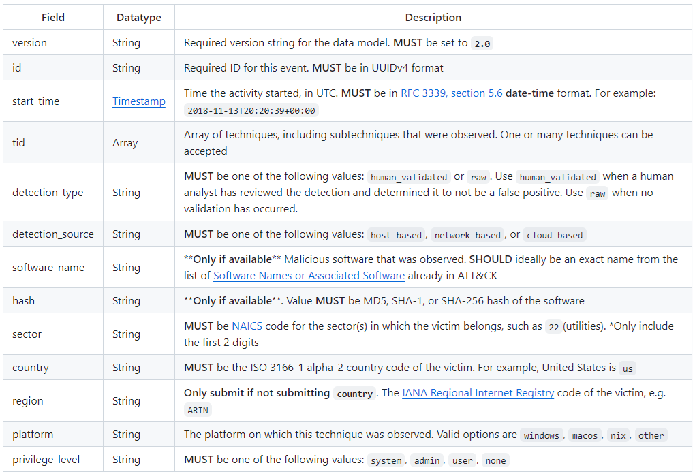

Introduction
=============
Adversaries are constantly evolving their attacks, driving up the cost of intrusions. Consequently, defenders must continue to protect against an increasing amount of adversary techniques and behaviors. Despite their best efforts, it is not possible to defend against all potential scenarios. This raises the questions, “How many MITRE ATT&CK techniques apply to the average organization?” and “Which techniques does an organization realistically need to defend against?”

Background
----------

..  TODO Add any chapters you wish as separate *.rst files that are referenced in the
    index.rst. This file can contain an introduction if you want, or delete it and
    create other chapters.

MITRE’s Center for Threat-Informed Defense (the Center) began addressing these questions with the Sightings Ecosystem. The project focused on creating an anonymous, community-sourced repository of technique detections to identify when and where ATT&CK techniques occurred in the wild. The Center, in collaboration with AttackIQ Inc., Cyber Threat Alliance, Fortinet’s FortiGuard Labs, HCA Healthcare, JP Morgan Chase, and Verizon Business Solutions, released a report in 2021 highlighting their key findings. Now, in collaboration with the same partners, the Center is updating the 2021 report to include current technique sightings and additional analysis. Since the last iteration of the Sightings Ecosystem, the Center has expanded the project’s repository and updated its data model to include additional fields. This information details common adversary behaviors and techniques, targeted industries, and observed software and accompanying privilege levels. With this data, defenders can develop a threat-informed defense strategy focused on the top techniques observed in the wild and the threats to their organization based on location, industry sector, and deployed platforms.

Framing our Analysis
---------------------

Adversaries are constantly evolving their attacks, driving up the cost of intrusions. Consequently, defenders must continue to protect against an increasing amount of adversary techniques and behaviors. Despite their best efforts, it is not possible to defend against all potential scenarios. This raises the questions, “How many MITRE ATT&CK techniques apply to the average organization?” and “Which techniques does an organization realistically need to defend against?”

Additionally, the quality of the data is limited to what the vendors generate. We provided a data model for submitting data, but it is up to the vendors which fields to include. While some fields are required, such as technique and data source, others are optional, such as region or privilege level. While we cannot verify the authenticity or accuracy of the data, we trust our contributors to provide complete and accurate data. Mapping observed events to adversary techniques is an art form and therefore has some degree of subjectivity. Where an adversary is using PowerShell to run an executable with a valid account, one analyst may mark the event as PowerShell Scripting, while another might mark it as Valid Accounts; it depends on the context and how the analyst views it. One mitigation for this bias is to mark the data with all relevant techniques (both PowerShell and Valid Accounts). However, due to our data model, we do not have any context about the event. We rely on the vendors to correctly assign techniques to the events. 

Furthermore, not all events are validated by human analysts. Just under half of the events we received were reviewed by human analysts; the rest were tagged as generated from raw events (likely, machine generated). This means that the labelling for those events is dependent on the tools and configurations used by the vendor. This can lead to a significant number of false positives, potentially skewing our data in unknown ways.

Of course, we are not omniscient. We cannot verify whether the data we received is representative of all global attacks. Our data is based on events that were found, not necessarily all attacks that occurred. Therefore, the shifts in techniques that occur over time may more accurately reflect the community’s ability to detect certain techniques, rather than those techniques being used more frequently. Despite these limitations, our data still gives us a unique insight into common techniques occurring in the wild.

Due to our time range (28 months) and variances in the ATT&CK version used by contributors, the Sightings we receive are sometimes notated in deprecated versions of ATT&CK. As the ATT&CK Framework evolves, techniques are added, removed, or merged. This causes issues when interpreting our data. For example, Timestomp was in our top 15 techniques. However, it has since been merged into Indicator Removal. This presents a challenge for us as we normalize the data and for the readers, who may be using different versions of ATT&CK. We have done our best to normalize all Techniques to the current version of ATT&CK (V14) for consistency.

Data model
----------

We provide a data model to potential contributors that shows the format for submitting information and includes required and optional fields. Between the first round of Sightings and this round, our data model changed slightly with the elimination of size, end_time, attribution, and attribution_type fields. Size, when combined with data from other fields, could reveal victim information despite our anonymizing attempts. It is also a difficult field to collect, like end_time, because contributors likely do not include this information in their own data collection. Additionally, attribution is a notoriously difficult problem in the cyber security community. It takes contributors significant time and effort to identify attribution, if it’s even possible to do. Because of these considerations and the lack of data for these fields in round 1, we removed them for round 2. We also added a platform field for round 2. This allowed us to easily view sightings across different operating systems.

