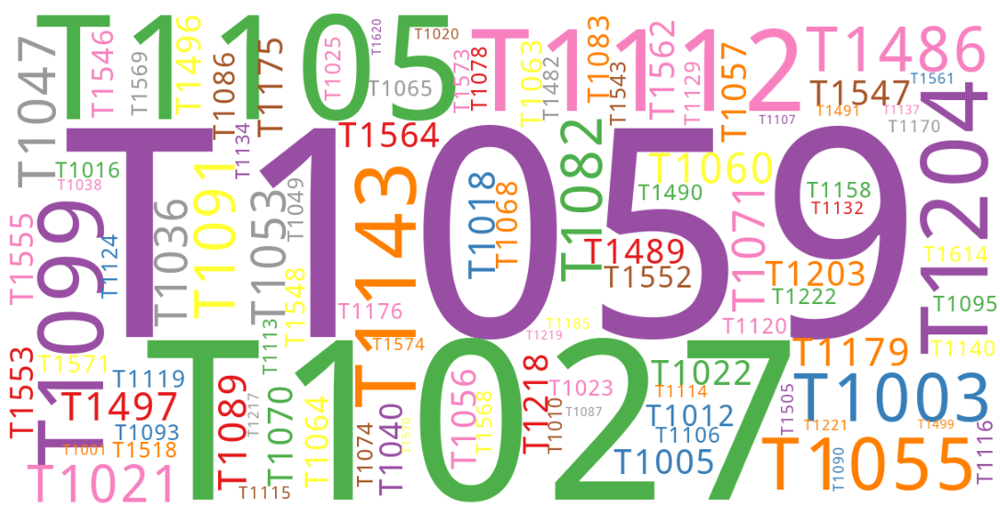
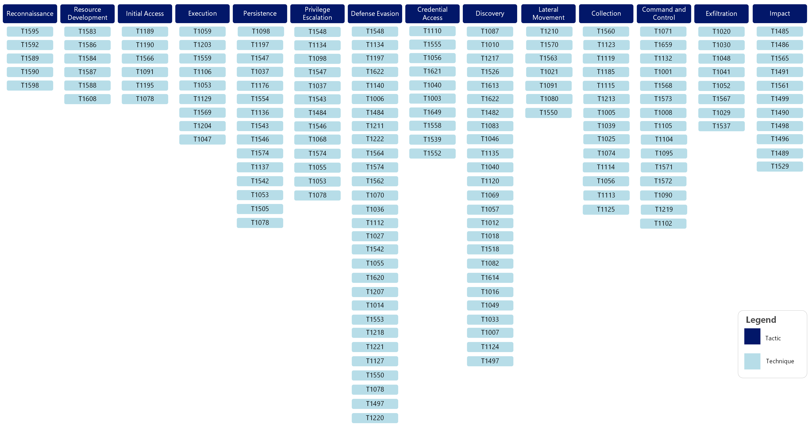
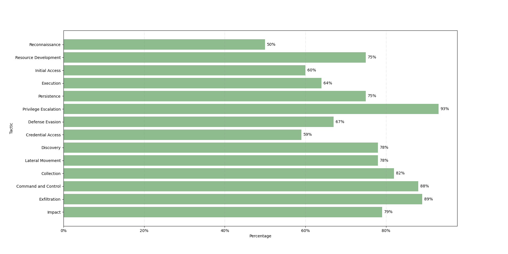
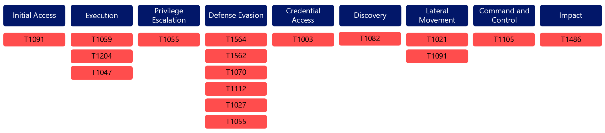

Key Results
===========

   Top 100 Techniques in the Sightings Data.

Key Figures
-----------

* Time Range: **Aug 2021 – Sept 2023**
* **1.6M+** Sightings
* **353** Unique Techniques
* **198** Countries
* **Over 300** ATT&CK Software Objects

What's in the Data
------------------

In Sightings 1.0, we had around 1.1M normalized sightings. Sightings 2.0 has around 1.6M
sightings and nearly twice as many unique techniques. This provides the Center with a
more comprehensive view of what techniques are being used in the wild. Out of 201 core
Enterprise techniques, we saw 173 techniques, or 86% of the ATT&CK Framework, in our
data.

   Sightings Techniques under their corresponding Tactic. (Click to enlarge)

When including sub-techniques, we saw 353 out of 625 techniques and sub-techniques, or
nearly 57%. This percentage is lower than the overall technique percentage because we
tended to only see a small number of sub-techniques per single technique. However, each
tactic was well-represented in our data.

   Percentage of Techniques seen per Tactic. (Click to enlarge)

Compared to our previous report, we observed some variations across the top 15
techniques. `T1059 – Command and Scripting Interpreter
<https://attack.mitre.org/techniques/T1059>`__ rose in rank from #2 to #1, and `T1053 –
Scheduled Task/Job <https://attack.mitre.org/techniques/T1053>`__, which was the #1
technique last time, didn’t rank in the top 15. Additionally, `T1090 – Proxy
<https://attack.mitre.org/techniques/T1090>`__, `T1036 – Masquerading
<https://attack.mitre.org/techniques/T1036>`__, `T1543 – Create or Modify System Process
<https://attack.mitre.org/techniques/T1543>`__, `T1574 – Hijack Execution Flow
<https://attack.mitre.org/techniques/T1574>`__, `T1095 – Non-Application Layer Protocol
<https://attack.mitre.org/techniques/T1095>`__, and `T1218 – System Binary Proxy
Execution <https://attack.mitre.org/techniques/T1218>`__ were also not seen in our top
15 techniques. While the last Sightings report focused mainly on analyzing the top
techniques, this time our data included some new information, allowing for additional
analysis.

We were able to observe the top techniques by sector, regions, software, platform, and
privilege level. We also analyzed the correlation between sectors and regions and how
software was used in sectors, platforms, and regions. Overall, over 300 different ATT&CK
software objects were seen in our data. Additionally, 20 sectors and almost all
countries were represented. To our surprise, outside of the US, nations in South America
represented some of our highest sightings. Out of the sectors, most sightings came from
the manufacturing sector - twice as much as the next closest sector. We anticipated a
more uniform distribution across sectors or the highest sightings from a sector that
cyber threat intelligence tends to report on, like the Professional, Scientific, and
Technical Services or Information sectors. While we collected sightings from multiple
platforms, the vast majority came from Windows environments. Similarly, while we
collected sightings from multiple privilege levels, most of the data reflects
low-privilege behavior (i.e., user-level). For future reports, we hope to have more
sightings from other platforms and privilege levels.

Top 15 Techniques
-----------------

.. figure:: _static/top15_breakdown.png
   :alt: Percentage of the top 15 techniques out of all techniques in our Sightings data.
   :scale: 20%
   :align: right

   Percentage of the Top 15 Techniques.

Of all techniques observed between 1 August 2021 to 30 September 2023, the top 15 most
observed techniques comprise 82 percent of our sightings. This is lower than our last
report, where the top 15 techniques comprised 90 percent of all observed techniques.
This difference is likely due to the larger data set analyzed for this report, as well
as a wider array of unique techniques seen during this timeframe.

1. `T1059 – Command and Scripting Interpreter <https://attack.mitre.org/techniques/T1059/>`_
2. `T1027 – Obfuscated Files or Information <https://attack.mitre.org/techniques/T1027/>`_
3. `T1105 – Ingress Tool Transfer <https://attack.mitre.org/techniques/T1105/>`_
4. `T1112 – Modify Registry <https://attack.mitre.org/techniques/T1112/>`_
5. `T1070 – Indicator Removal <https://attack.mitre.org/techniques/T1070/>`_
6. `T1204 – User Execution <https://attack.mitre.org/techniques/T1204/>`_
7. `T1564 – Hide Artifacts <https://attack.mitre.org/techniques/T1564/>`_
8. `T1055 – Process Injection <https://attack.mitre.org/techniques/T1055/>`_
9. `T1003 – OS Credential Dumping <https://attack.mitre.org/techniques/T1003/>`_
10. `T1021 – Remote Services <https://attack.mitre.org/techniques/T1021/>`_
11. `T1486 – Data Encrypted for Impact <https://attack.mitre.org/techniques/T1486/>`_
12. `T1091 – Replication Through Removable Media <https://attack.mitre.org/techniques/T1091/>`_
13. `T1082 – System Information Discovery <https://attack.mitre.org/techniques/T1082/>`_
14. `T1047 – Windows Management Instrumentation <https://attack.mitre.org/techniques/T1047/>`_
15. `T1562 – Impair Defenses <https://attack.mitre.org/techniques/T1562/>`_

The top 15 Enterprise techniques represent 9 out of 14 ATT&CK Tactics. This demonstrates
the range and scope of our most observed data.

   Breakdown of Top 15 Techniques by Tactic. (Click to enlarge)

Top 10 NIST 800-53 Controls
---------------------------

Using the Center’s mappings of the National Institute of Standards and Technology (NIST)
Special Publication (SP) 800-53 revision 5 to ATT&CK, we can identify which NIST
controls are the most effective in protecting against our top 15 techniques. Overall,
Access Control, System and Information Integrity, and Configuration Management controls
are the most frequently seen.

1. `SI-03 Malicious Code Protection
   <https://center-for-threat-informed-defense.github.io/mappings-explorer/external/nist/attack-14.1/domain-enterprise/nist-rev5/SI-03/>`_
2. `SI-04 System Monitoring
   <https://center-for-threat-informed-defense.github.io/mappings-explorer/external/nist/attack-14.1/domain-enterprise/nist-rev5/SI-04/>`_
3. `CM-06 Configuration Settings
   <https://center-for-threat-informed-defense.github.io/mappings-explorer/external/nist/attack-14.1/domain-enterprise/nist-rev5/CM-06/>`_
4. `CM-02 Baseline Configuration
   <https://center-for-threat-informed-defense.github.io/mappings-explorer/external/nist/attack-14.1/domain-enterprise/nist-rev5/CM-02/>`_
5. `AC-03 Access Enforcement
   <https://center-for-threat-informed-defense.github.io/mappings-explorer/external/nist/attack-14.1/domain-enterprise/nist-rev5/AC-03/>`_
6. `AC-06 Least Privilege
   <https://center-for-threat-informed-defense.github.io/mappings-explorer/external/nist/attack-14.1/domain-enterprise/nist-rev5/AC-06/>`_
7. `CM-07 Least Functionality
   <https://center-for-threat-informed-defense.github.io/mappings-explorer/external/nist/attack-14.1/domain-enterprise/nist-rev5/CM-07/>`_
8. `SI-07 Software, Firmware, and Information Integrity
   <https://center-for-threat-informed-defense.github.io/mappings-explorer/external/nist/attack-14.1/domain-enterprise/nist-rev5/SI-07/>`_
9. `CA-07 Continuous Monitoring
   <https://center-for-threat-informed-defense.github.io/mappings-explorer/external/nist/attack-14.1/domain-enterprise/nist-rev5/CA-07/>`_
10. `AC-02 Account Management
    <https://center-for-threat-informed-defense.github.io/mappings-explorer/external/nist/attack-14.1/domain-enterprise/nist-rev5/AC-02/>`_

.. figure:: _static/nist_controls.png
   :alt: Top 10 NIST Controls and their coverage of the Top 15 Techniques.
   :width: 100%
   :align: center

   Top 10 NIST Controls and their coverage of the Top 15 Techniques. (Click to enlarge)

Download Data
-------------

Download the cleaned and anonymized Sightings 2.0 dataset.

.. raw:: html

    

        <a class="btn btn-primary" target="_blank" href="https://ctidpublic.blob.core.windows.net/sightings/sightings_v2_public.csv" download="sightings_v2_public.csv">
        <i class="fa fa-download"></i> Download Sightings CSV (25.7 MiB)</a>
    

