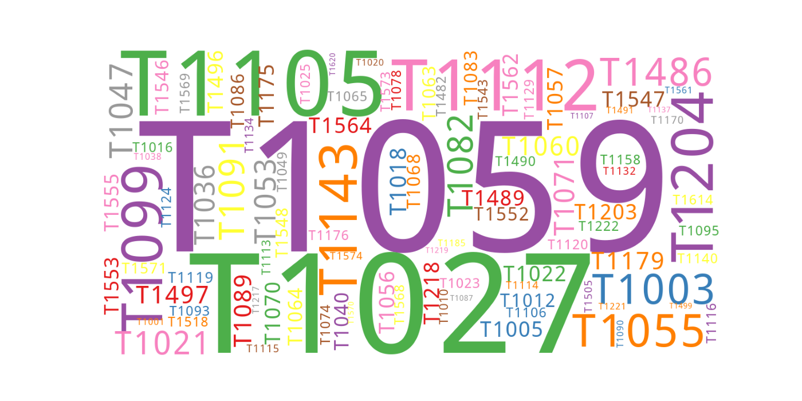
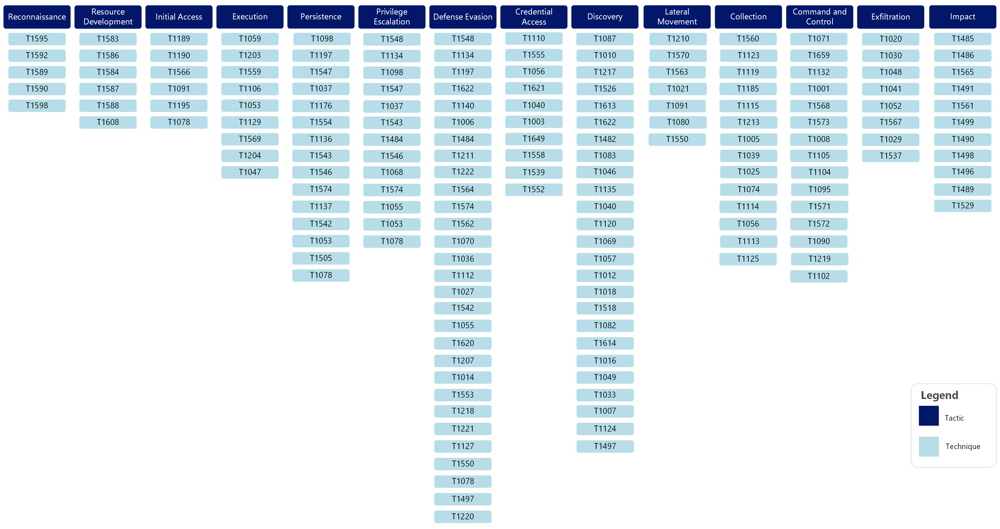
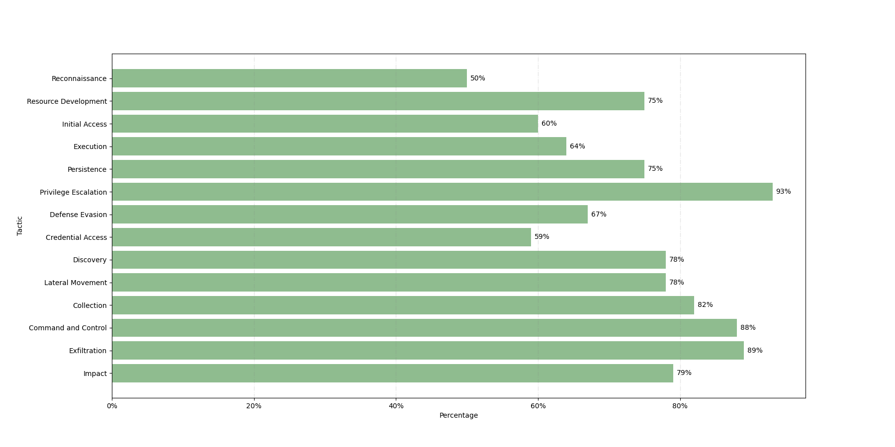
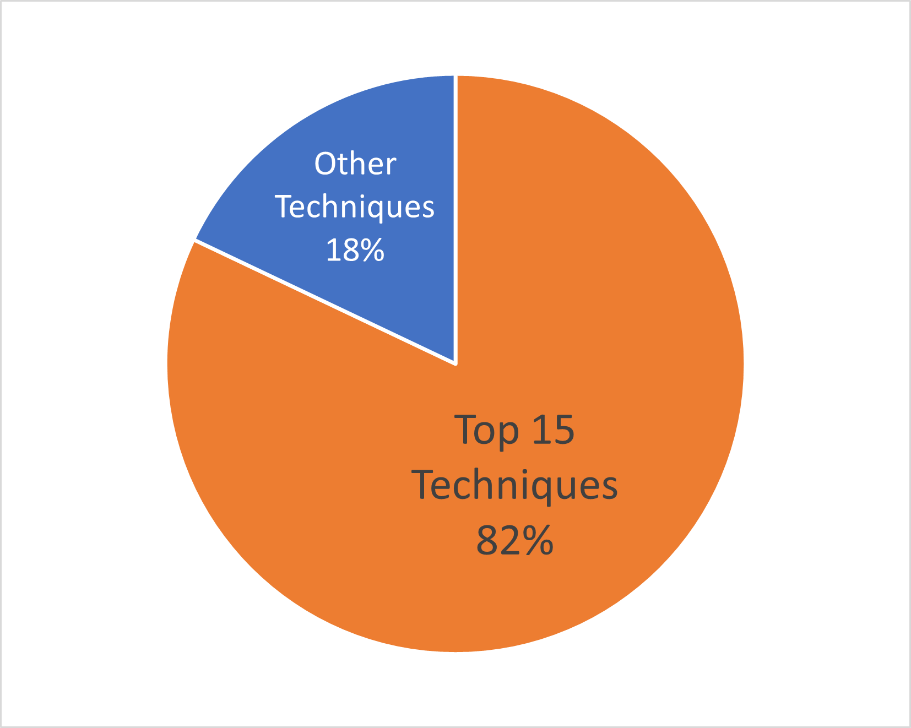
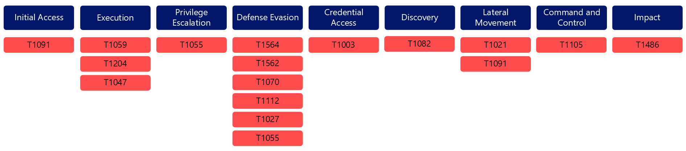
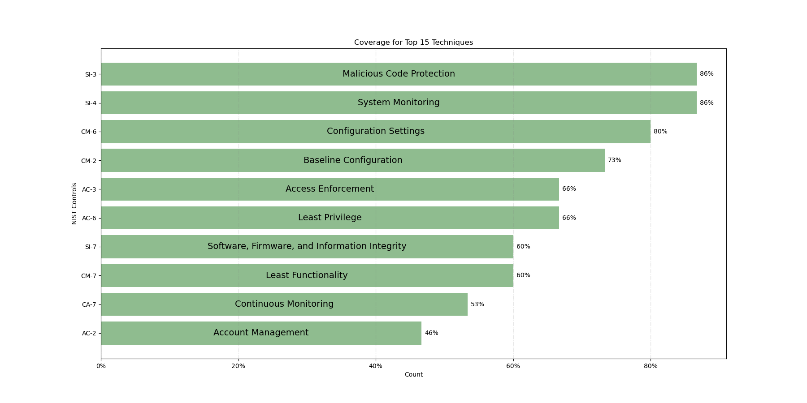

Overview
########

   Top 100 Techniques in the Sightings Data.

Time Range: Aug 2021 - Nov 2023

1.6M+ Sightings

353 Unique Techniques

198 Countries

300+ Software Represented

What's in the Data
-------------------
In the last paper, we had around 1.1M normalized sightings. This round we have around 1.6M sightings. Consequently, we have nearly twice as many unique techniques this round for analysis. This provides the Center with a more comprehensive view of what techniques are being used in the wild.

Out of 201 core Enterprise techniques, we saw 173 techniques, or 86% of the ATT&CK Framework, in our data. 

   Sightings Techniques under their corresponding Tactic.

When including sub-techniques, we saw 353 out of 625 techniques and sub-techniques, or nearly 57%. This percentage is lower than the overall technique percentage because we tended to only see a small number of sub-techniques per single technique. However, each Tactic was well-represented in our data. 

   Percentage of Techniques seen per Tactic.

Compared to our previous report, we observed some variations across the top 15 techniques. T1059 rose in rank from #2 to #1, and Scheduled Task (T1053), which was the #1 technique last time, didn’t rank in the top 15. Additionally, Proxy (T1090), Masquerading (T1036), Create or Modify System Process (T1543), Hijack Execution Flow (T1574), Non-Application Layer Protocol (T1095), and Signed Binary/Proxy Execution (T1218) were also not seen in our top 15 techniques. 
While the last Sightings report focused mainly on analyzing the top techniques, this time our data included some new information, allowing for additional analysis. We were able to observe the top techniques by sector, regions, software, platform, and privilege level. We also analyzed the correlation between sectors and regions and how software was used in sectors, platforms, and regions. Overall, over 300 different software was seen in our data. Additionally, 20 sectors and almost all countries were represented. To our surprise, outside of the US, nations in South America represented some of our highest sightings. Out of the sectors, most sightings came from the manufacturing sector - twice as much as the next closest sector. We anticipated a more uniform distribution across sectors or the highest sightings from a sector that cyber threat intelligence tends to report on, like the Professional, Scientific, and Technical Services or Information sectors. While we collected sightings from multiple platforms, the vast majority still came from Windows environments. Similarly, while we collected sightings from different privilege levels, most only used user permissions. For future reports, we hope to have more sightings from other platforms and privilege levels.

Top 15 Techniques
------------------

   Percentage of the Top 15 Techniques.
   
Of all techniques observed between 1 August 2021 to 30 November 2023, the top 15 most observed techniques comprise 82 percent of our sightings. This is lower than our last report, where the top 15 techniques comprised 90 percent of all observed techniques. This difference is likely due to the larger data set analyzed for this report, as well as a wider array of unique techniques seen during this timeframe. 

1. Command and Scripting Interpreter `[T1059] <https://attack.mitre.org/techniques/T1059/>`_
2. Obfuscated Files or Information `[T1027] <https://attack.mitre.org/techniques/T1027/>`_
3. Ingress Tool Transfer `[T1105] <https://attack.mitre.org/techniques/T1105/>`_
4. Modify Registry `[T1112] <https://attack.mitre.org/techniques/T1112/>`_
5. Indicator Removal `[T1070] <https://attack.mitre.org/techniques/T1070/>`_ 
6. User Execution `[T1204] <https://attack.mitre.org/techniques/T1204/>`_
7. Hide Artifacts `[T1564] <https://attack.mitre.org/techniques/T1564/>`_ 
8. Process Injection `[T1055] <https://attack.mitre.org/techniques/T1055/>`_
9. OS Credential Dumping `[T1003] <https://attack.mitre.org/techniques/T1003/>`_ 
10. Remote Services `[T1021] <https://attack.mitre.org/techniques/T1021/>`_ 
11. Data Encrypted for Impact `[T1486] <https://attack.mitre.org/techniques/T1486/>`_ 
12. Replication Through Removable Media `[T1091] <https://attack.mitre.org/techniques/T1091/>`_ 
13. System Information Discovery `[T1082] <https://attack.mitre.org/techniques/T1082/>`_ 
14. Windows Management Instrumentation `[T1047] <https://attack.mitre.org/techniques/T1047/>`_ 
15. Impair Defenses `[T1562] <https://attack.mitre.org/techniques/T1562/>`_

The top 15 Enterprise techniques represent 9 out of 14 ATT&CK Tactics. This demonstrates the range and scope of our most observed data. 

   Breakdown of Top 15 Techniques by Tactic.

Top 10 NIST 800-53 Controls
----------------------------
Using the Center’s mappings of the National Institute of Standards and Technology (NIST) Special Publication (SP) 800-53 revision 5 to ATT&CK, we can identify which NIST controls are the most effective in protecting against our top 15 techniques. Overall, Access Control, System and Information Integrity, and Configuration Management controls are the most frequently seen.  

1.	SI-3 Malicious Code Protection
2.	SI-4 System Monitoring
3.	CM-6 Configuration Settings
4.	CM-2 Baseline Configuration
5.	AC-3 Access Enforcement
6.	AC-6 Least Privilege
7.	CM-7 Least Functionality
8.	SI-7 Software, Firmware, and Information Integrity
9.	CA-7 Continuous Monitoring
10.	AC-2 Account Management

   Top 10 NIST Controls and their coverage of the Top 15 Techniques.