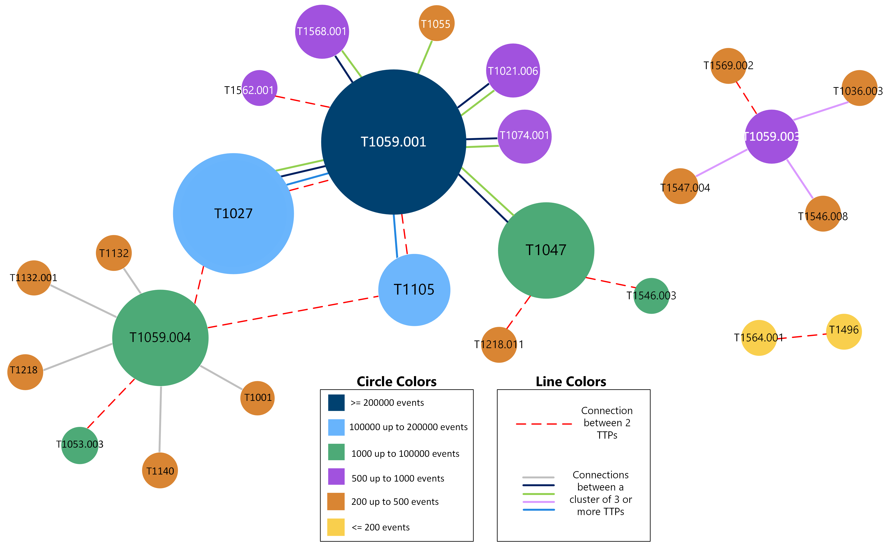
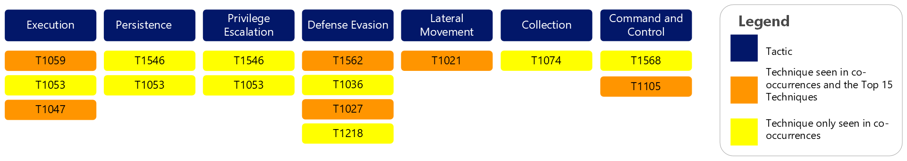

Technique Co-Occurrences
========================
 For the purposes of this paper, a co-occurrence means that a sighting event contains more than one technique. Within our data, 18.96% of events contained co-occurrences. Interestingly, we discovered multiple events contained the same cluster of techniques.

   Top 15 Technique Co-occurrences. (Click to enlarge)

This graphic shows several attributes of the top 15 co-occurrences. The size of each
sphere represents how frequently the technique occurred within the top 15 events. In
size order,

1. `T1059.001 – PowerShell <https://attack.mitre.org/techniques/T1059/001>`__
2. `T1027 – Obfuscated Files or Information <https://attack.mitre.org/techniques/T1027>`__
3. `T1047 – Windows Management Instrumentation <https://attack.mitre.org/techniques/T1047>`__
4. `T1059.004 – Unix Shell <https://attack.mitre.org/techniques/T1059/004>`__
5. `T1105 – Ingress Tool Transfer <https://attack.mitre.org/techniques/T1105>`__
6. `T1021.006 – Windows Remote Management <https://attack.mitre.org/techniques/T1021/006>`__
7. `T1074.001 – Local Data Staging <https://attack.mitre.org/techniques/T1074/001>`__
8. `T1568.001 – Fast Flux DNS <https://attack.mitre.org/techniques/T1568/001>`__
9. `T1059.003 – Windows Command Shell <https://attack.mitre.org/techniques/T1059/003>`__
10. `T1546.003 – Windows Management Instrumentation Event Subscription <https://attack.mitre.org/techniques/T1546/003>`__
11. `T1053.003 – Cron <https://attack.mitre.org/techniques/T1053/003>`__
12. `T1562.001 – Disable or Modify Tools <https://attack.mitre.org/techniques/T1562/001>`__
13. `T1218 – System Binary Proxy Execution <https://attack.mitre.org/techniques/T1218>`__
14. `T1036.003 – Rename System Utilities <https://attack.mitre.org/techniques/T1036/003>`__
15. `T1546.008 – Accessibility Features <https://attack.mitre.org/techniques/T1546/008>`__

The color of the sphere shows how many events contained the co-occurred technique.
Different lines were used to show each co-occurrence grouping. When an event contained
only two techniques, a dashed, red line was used. When an event contained three or more
techniques, a solid line was used. The different colors of the solid lines are
associated with the different groupings of co-occurrences. For example, T1564.001 is a
small, yellow sphere, indicating that it was seen the least number of times out of the
top 15 co-occurrences and in less than 200 events; it is connected by a red, dashed line
to T1496, indicating that it co-occurred only with this technique. Conversely, T1059.001
is a large, blue sphere, indicating that it was seen the greatest number of times and in
over 200,000 events; it is connected by both types of lines and several colored lines.
It was grouped with T1027 and T1105 in over 140,000 events (represented by the blue
line), the most out of any co-occurrences, and seen nearly 40,000 times with T1105 and
around 34,500 times with T1027. It is also included in the largest grouping we saw –
T1059.001, T1021.006, T1027, T1047, T1055, T1074.001, and T1568.001, represented by the
light green line. Similarly, the same cluster of techniques, without T1055, were seen
just as frequently, represented by the black line.

 .. figure:: _static/co-occurrence_software.png
   :alt: Top 15 Technique Co-occurrences.
   :scale: 60%
   :align: right

   Co-occurrence Software.

Most co-occurrence events include region, sector, platform, and privilege level
information, providing insight into how adversaries are using these techniques. Over
200,000 events occur in the United States, with much smaller amounts occurring in
Ukraine, Turkey, and Bangladesh. This aligns with the broader regional trend in our
data, with a significant majority of events occurring in the US. Additionally, over 98%
of co-occurrence events are Windows-based, which also aligns with the overall trend in
our data. Adversaries used co-occurring techniques to largely target the Manufacturing,
Administrative Support sectors. This is semi-similar to our broader data trend, where
Manufacturing constitutes around 24% of sighting events, the most of any sector, and
Administrative Support comprises around 9% of sighting events, the 3rd most out of all
sectors. Overall, our data shows around 91% of events using user-level privileges, with
around 8% using SYSTEM level privileges. However, co-occurrences swap these amounts,
with around 97% using SYSTEM level privileges and around 2% using user-level privileges.
When comparing multiple attributes at once (e.g., co-occurrences by region and
platform), these trends remain the same.

When reviewing the software for co-occurrences Cobalt strike was seen most frequently,
followed by AgentTesla. In our overall data trends, AgentTesla was seen the second most
frequently; however, Cobalt Strike was not even in the top 50.

   Co-occurrence by Tactics. (Click to enlarge)

Out of the top 15 co-occurrences, only 6 techniques, or 7 sub-techniques, are not in the
top 15 techniques. When we pivot to Tactics, co-occurrences are observed at a similar
percentage as our top 15 techniques. However, co-occurrences cover 10% of Persistence
tactics and around 5% of Collection tactics, neither of which are covered by our top 15
techniques.
