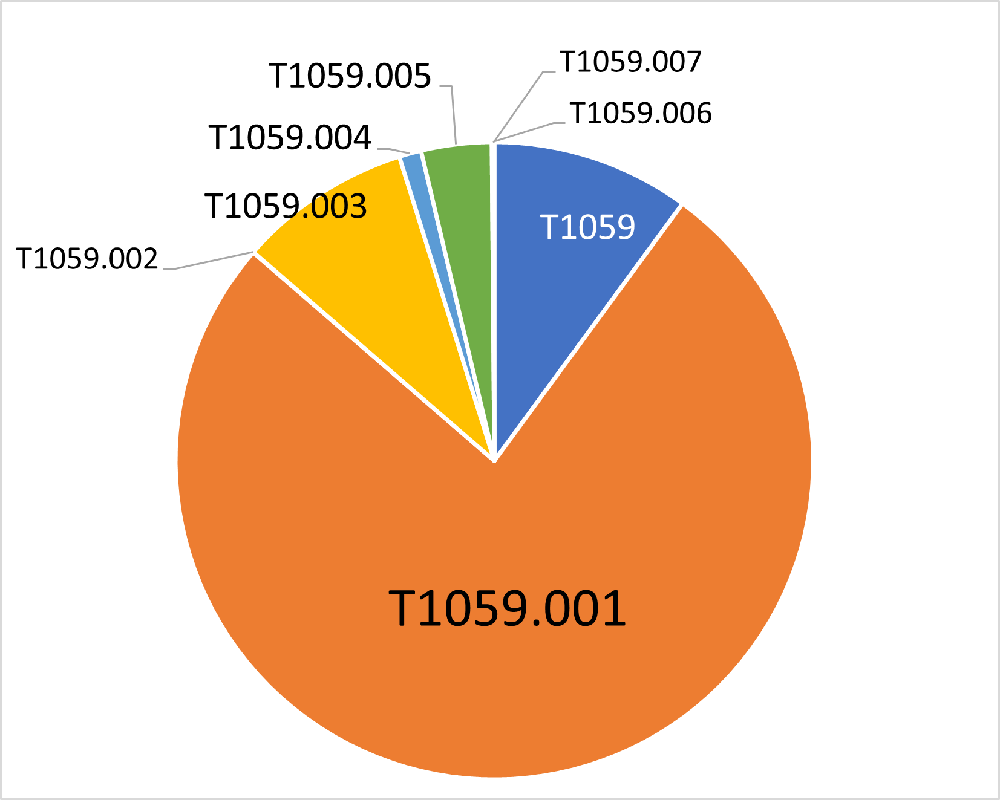
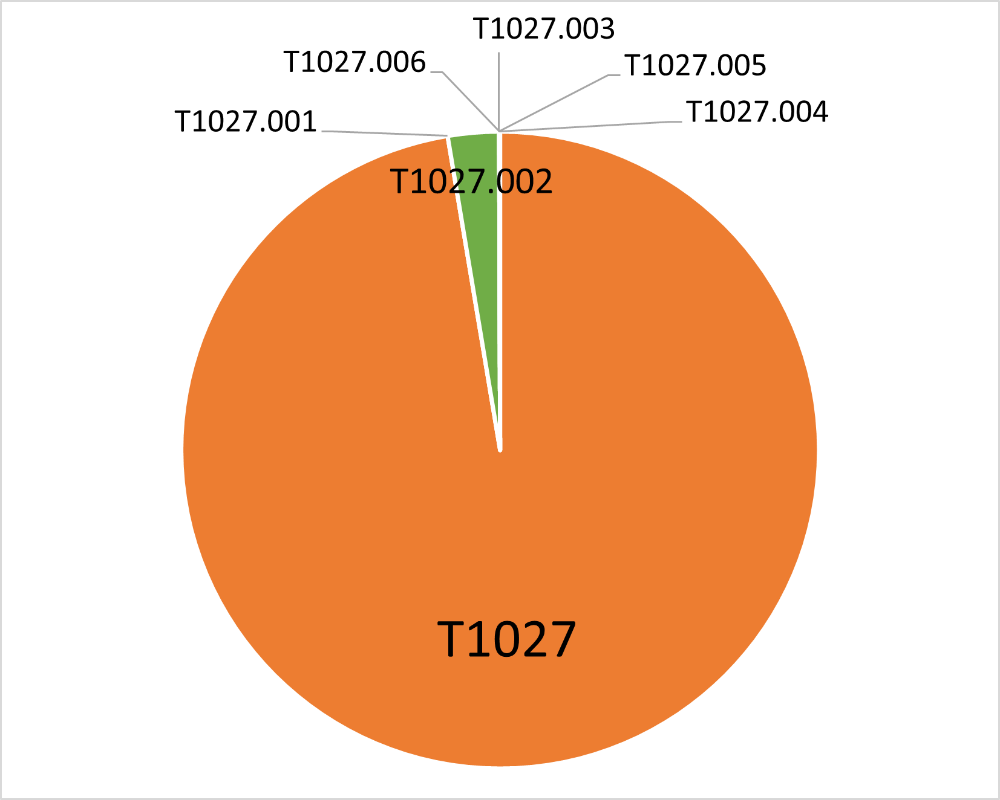

Top 15 Techniques
#################

In this section, we dive deep into the top 15 most observed techniques. If a technique
has sub-techniques in the ATT&CK framework, then we divided it into its sub-techniques;
however, we only focused on the sub-techniques seen in our data. This provides more
granular glimpse into each technique for defenders. The majority of the top 15
techniques abuse legitimate system tools. This underscores the idea that adversaries are
attempting to appear as legitimate users.

We have incorporated relevant security controls from the Center’s `NIST SP 800-53 to
ATT&CK mappings
<https://center-for-threat-informed-defense.github.io/mappings-explorer/external/nist/>`__
and detection methods from the `Cyber Analytics Repository
<https://car.mitre.org/analytics/>`_ and the Center’s `Sensor Mappings to ATT&CK
<https://ctid.mitre.org/projects/sensor-mappings-to-attack>`_,
which connects conceptual data sources to sensors and other tools. Due to the number of
Windows events in our data, we chose to focus on sensor mappings for Sysmon and Windows
event logs (WinEvtx). We provide prevention and detection controls focused on creating
strong baselines, restricting permissions, and refining logs for process creation to
detect and disrupt adversary behaviors.

1. `T1059 – Command and Scripting Interpreter <https://attack.mitre.org/techniques/T1059>`__
********************************************************************************************

Description
-----------

Command and Scripting Interpreter is a commonly used living-off-the-land technique. Most
platforms have built-in command-line interfaces or scripting capabilities, allowing
adversaries to use them for executing arbitrary commands, scripts, or binaries.

Overall, T1059 is the most sighted technique in our data, in part because we normalized
our data, which included T1064 and T1086 from previous ATT&CK versions, to T1059. The
overwhelming majority of the sightings come from `T1059.001 – PowerShell
<https://attack.mitre.org/techniques/T1059/001>`__. This is not surprising as it is a
common tool used by adversaries for its ubiquity, versatility, and ability to obfuscate
activity. The second most observed sub-technique is `T1059.003 – Windows Command Shell
<https://attack.mitre.org/techniques/T1059/003>`__, which is similarly unsurprising for
its ubiquity in Windows environments. The following sub-techniques comprise less than 5%
of T1059 sightings:

* `T1059.002 – AppleScript <https://attack.mitre.org/techniques/T1059/002>`__
* `T1059.004 – Unix Shell <https://attack.mitre.org/techniques/T1059/004>`__
* `T1059.005 – Visual Basic <https://attack.mitre.org/techniques/T1059/005>`__
* `T1059.006 – Python <https://attack.mitre.org/techniques/T1059/006>`__
* `T1059.007 – JavaScript <https://attack.mitre.org/techniques/T1059/007>`__

While these techniques are not difficult to monitor for, they are regularly used by
benign programs, which makes detection of malicious usage difficult.

T1059 is evenly distributed between user and SYSTEM privileges. It follows the overall
data trends, with the US as the top region, Windows as the top platform, Manufacturing
as the top sector, and Heodo (another name for Emotet) as the top software.

Prevention
----------

The Center's `NIST 800-53 mappings
<https://center-for-threat-informed-defense.github.io/mappings-explorer/external/nist/>`_
list 24 security controls to mitigate Command and Script Interpreter:

* **AC-2 Account Management** (Also mitigates PowerShell, AppleScript, Visual Basic,
  Windows Command Shell, Unix Shell, Python, JavaScript)
* **AC-3 Access Enforcement** (Also mitigates PowerShell, AppleScript, Visual Basic,
  Windows Command Shell, Unix Shell, Python, JavaScript)
* **AC-5 Separation of Duties** (Also mitigates PowerShell)
* **AC-6 Least Privilege** (Also mitigates PowerShell, AppleScript, Visual Basic,
  Windows Command Shell, Unix Shell, Python, JavaScript)
* **AC-17 Remote Access** (Also mitigates PowerShell, AppleScript, Visual Basic, Windows
  Command Shell, Unix Shell, Python, JavaScript)
* **CA-7 Continuous Monitoring** (Also mitigates Visual Basic and JavaScript)
* **CA-8 Penetration Testing**
* **CM-2 Baseline Configuration** (Also mitigates PowerShell, AppleScript, Visual Basic,
  Windows Command Shell, Unix Shell, Python, JavaScript)
* **CM-5 Access Restrictions for Change** (Also mitigates PowerShell and Python)
* **CM-6 Configuration Settings** (Also mitigates PowerShell, AppleScript, Visual Basic,
  Windows Command Shell, Unix Shell, Python, JavaScript)
* **CM-7 Least Functionality** (Also mitigates Visual Basic and JavaScript)
* **CM-8 System Component Inventory** (Also mitigates PowerShell, Visual Basic,
  JavaScript)
* **CM-11 User-Installed Software** (Also mitigates Python)
* **IA-2 Identification and Authentication (organizational Users)** (Also mitigates
  PowerShell)
* **IA-8 Identification and Authentication (non-organizational Users)** (Also mitigates
  PowerShell)
* **IA-9 Service Identification and Authentication** (Also mitigates PowerShell and
  AppleScript)
* **RA-5 Vulnerability Monitoring and Scanning** (Also mitigates PowerShell, Visual
  Basic, and JavaScript)
* **SC-18 Mobile Code** (Also mitigates Visual Basic and JavaScript)
* **SI-2 Flaw Remediation** (Also mitigates PowerShell, Visual Basic, Python)
* **SI-3 Malicious Code Protection** (Also mitigates PowerShell, AppleScript, Visual
  Basic, Windows Command Shell, Unix Shell, Python, JavaScript)
* **SI-4 System Monitoring** (Also mitigates PowerShell, AppleScript, Visual Basic,
  Windows Command Shell, Unix Shell, Python, JavaScript)
* **SI-7 Software, Firmware, and Information Integrity** (Also mitigates PowerShell,
  AppleScript, Visual Basic, Windows Command Shell, Unix Shell, Python, JavaScript)
* **SI-10 Information Input Validation** (Also mitigates PowerShell, AppleScript, Visual
  Basic, Windows Command Shell, Unix Shell, Python, JavaScript)
* **SI-16 Memory Protection** (Also mitigates PowerShell, AppleScript, Visual Basic,
  Windows Command Shell, Unix Shell, Python, JavaScript)

The Center's NIST 800-53 mappings list 1 security control to mitigate Python:

* **CM-3 Configuration Change Control**

The Center's NIST 800-53 mappings list 4 security controls to mitigate AppleScript:

* **SR-4 Provenance**
* **SR-5 Acquisition Strategies, Tools, and Methods**
* **SR-6 Supplier Assessments and Reviews**
* **SR-11 Component Authenticity**

Detections
----------

CAR
^^^

Rules for the core technique:

* `CAR-2021-01-002: Unusually Long Command Line Strings
  <https://car.mitre.org/analytics/CAR-2021-01-002/>`_

Rules for PowerShell:

* `CAR-2014-04-003: PowerShell Execution
  <hhttps://car.mitre.org/analytics/CAR-2014-04-003/>`_
* `CAR-2014-11-004: Remote PowerShell Sessions
  <https://car.mitre.org/analytics/CAR-2014-11-004/>`_

Rules for Windows Command Shell:

* `CAR-2013-02-003: Processes Spawning cmd.exe
  <https://car.mitre.org/analytics/CAR-2013-02-003/>`_
* `CAR-2014-11-002: Outlier Parents of Cmd
  <https://car.mitre.org/analytics/CAR-2014-11-002/>`_

Rules for Visual Basic:

* `CAR-2013-04-002: Quick execution of a series of suspicious commands
  <https://car.mitre.org/analytics/CAR-2013-04-002/>`_

Sensor Mappings to ATT&CK
^^^^^^^^^^^^^^^^^^^^^^^^^^

.. list-table::
  :widths: 20 50
  :header-rows: 0

  * - **Sysmon**
    - 1, 7, 30

  * - **Winevtx**
    - 4103, 4104, 4688, 4696

2. `T1027 – Obfuscated Files or Information <https://attack.mitre.org/techniques/T1027>`__
******************************************************************************************

Description
-----------

Adversaries may encrypt, encode, or otherwise obfuscate payloads, files, scripts, or
commands to avoid detection. Attackers can use T1027 to compress, archive, encrypt, or
split payloads into multiple files; password protect or encode portions of files; or
obfuscate commands in scripts. T1027 is often combined with `T1140 – Deobfuscate/Decode
Files or Information <https://attack.mitre.org/techniques/T1140>`__, `T1204 – User
Execution <https://attack.mitre.org/techniques/T1204>`__, `T1059 – Command and Scripting
Interpreter <https://attack.mitre.org/techniques/T1059>`__, and others depending on how
obfuscation was used during the attack.

A majority of T1027 sightings did not include sub-techniques. This is likely due in part to
normalizing our data, which included T1045 and T1066 from previous ATT&CK versions, to
T1027. The most observed sub-technique was `T1027.002 – Software Packing
<https://attack.mitre.org/techniques/T1027/002>`__. Adversaries use this sub-technique
to evade detection of their code, particularly from signature-based detections. We also
saw a small amount of the following sub-techniques:

* `T1027.001 – Binary Padding <https://attack.mitre.org/techniques/T1027/001>`__
* `T1027.003 – Steganography <https://attack.mitre.org/techniques/T1027/003>`__
* `T1027.004 – Compile After Delivery <https://attack.mitre.org/techniques/T1027/004>`__
* `T1027.005 – Indicator Removal from Tools <https://attack.mitre.org/techniques/T1027/005>`__
* `T1027.006 – HTML Smuggling <https://attack.mitre.org/techniques/T1027/006>`__

T1027 was evenly distributed between different software. It followed the overall data
trends, with the US as the top region, Windows as the top platform, and Manufacturing as
the top sector. Notably, it deviated from the overall privilege level trend, with more
SYSTEM level permissions seen.

Prevention
----------

The Center's NIST 800-53 mappings list 6 security controls to mitigate Obfuscated Files
or Information:

* **CM-2 Baseline Configuration**
* **CM-6 Configuration Settings**
* **SI-2 Flaw Remediation** (Also mitigates Software Packing)
* **SI-3 Malicious Code Protection** (Also mitigates Software Packing)
* **SI-4 System Monitoring** (Also mitigates Software Packing)
* **SI-7 Software, Firmware, and Information Integrity** (Also mitigates Software Packing)

Detections
----------

CAR
^^^

None

Sensor Mappings to ATT&CK
^^^^^^^^^^^^^^^^^^^^^^^^^^

.. list-table::
  :widths: 20 50
  :header-rows: 0

  * - **Sysmon**
    - 1, 11, 12, 15, 19, 20, 7

  * - **Winevtx**
    - 4103, 4104, 4657, 4663, 4664, 4688, 4696, 5857, 5858, 5859, 5860, 5861

3. `T1105 – Ingress Tool Transfer <https://attack.mitre.org/techniques/T1105>`__
********************************************************************************

Description
-----------

Adversaries may transfer tools or other files from a command-and-control system into a
compromised environment. They can conduct living-of-the-land attacks using native
utilities or installers and package managers in Windows, Linux, and MacOS systems to
download files. Adversaries can also download files through Cloud-based services, such
as Dropbox or OneDrive, that sync with the targeted systems.

Nearly all instances of this technique came from the US on Windows-based systems, with
SYSTEM or user-level privileges, in the Manufacturing or Administrative and Support and
Waste Management and Remediation Services sectors. T1105 was distributed evenly across
different software. Given this technique’s high occurrence, it is notable that it was
not reported at higher rates in other sectors or with administrative level privileges.

Prevention
----------

The Center's NIST 800-53 mappings list 8 security controls to mitigate Ingress Tool Transfer:

* **AC-4 Information Flow Enforcement**
* **CA-7 Continuous Monitoring**
* **CM-2 Baseline Configuration**
* **CM-6 Configuration Settings**
* **CM-7 Least Functionality**
* **SC-7 Boundary Protection**
* **SI-3 Malicious Code Protection**
* **SI-4 System Monitoring**

Detections
----------

CAR
^^^

Rules for the core technique:

* `CAR-2013-07-001: Suspicious Arguments
  <https://car.mitre.org/analytics/CAR-2013-07-001/>`_
* `CAR-2021-05-005: BITSAdmin Download File
  <https://car.mitre.org/analytics/CAR-2021-05-005/>`_
* `CAR-2021-05-006: CertUtil Download With URLCache and Split Arguments
  <https://car.mitre.org/analytics/CAR-2021-05-006/>`_
* `CAR-2021-05-007: CertUtil Download With VerifyCtl and Split Arguments
  <https://car.mitre.org/analytics/CAR-2021-05-007/>`_

Sensor Mappings to ATT&CK
^^^^^^^^^^^^^^^^^^^^^^^^^^

.. list-table::
  :widths: 20 50
  :header-rows: 0

  * - **Sysmon**
    - 11, 15, 3

  * - **Winevtx**
    - 4663, 5031, 5154, 5155, 5156, 5157, 5158, 5159

4. `T1112 – Modify Registry <https://attack.mitre.org/techniques/T1112>`__
**************************************************************************

Description
-----------

Adversaries may use built-in command line tools or the Win32 API to interact with the
Windows Registry to hide configuration information, remove information, or as part of
other techniques for Execution and Persistence. Specific areas of the registry depend on
account permissions to access, potentially requiring adversaries to gain
administrator-level privileges to modify. The Windows registry is a significant
component of Windows, making it an attractive tool for adversaries to use.

T1112 sightings occur on Windows-based platforms and were evenly distributed across
different countries, sectors, and software. We lacked a meaningful amount of data for
privilege level analysis. Overall, we received significantly more sightings of T1112 in
2023 than in 2022; this could be due to attackers using this technique more frequently
during their operations. However, the registry has been a common attack vector for
years, so this sudden increase in Sightings is likely due to statistical noise.

Prevention
----------

The Center's NIST 800-53 mappings list 2 security controls to mitigate Modify Registry:

* **AC-6 Least Privilege**
* **CM-7 Least Functionality**

Detections
----------

CAR
^^^

Rules for core technique:

* `CAR-2013-01-002: Autorun Differences
  <https://car.mitre.org/analytics/CAR-2013-01-002/>`_
* `CAR-2013-03-001: Reg.exe called from Command Shell
  <https://car.mitre.org/analytics/CAR-2013-03-001/>`_
* `CAR-2013-04-002: Quick execution of a series of suspicious commands
  <https://car.mitre.org/analytics/CAR-2013-04-002/>`_
* `CAR-2014-11-005: Remote Registry <https://car.mitre.org/analytics/CAR-2014-11-005/>`_
* `CAR-2020-05-003: Rare LolBAS Command Lines
  <https://car.mitre.org/analytics/CAR-2020-05-003/>`_
* `CAR-2021-11-001: Registry Edit with Creation of SafeDllSearchMode Key Set to 0
  <https://car.mitre.org/analytics/CAR-2021-11-001/>`_
* `CAR-2021-11-002: Registry Edit with Modification of Userinit, Shell, or Notify
  <https://car.mitre.org/analytics/CAR-2021-11-002/>`_
* `CAR-2021-12-002: Modification of Default Startup Folder in the Registry Key ‘Common
  Startup’ <https://car.mitre.org/analytics/CAR-2021-12-002/>`_

Sensor Mappings to ATT&CK
^^^^^^^^^^^^^^^^^^^^^^^^^^

.. list-table::
  :widths: 20 50
  :header-rows: 0

  * - **Sysmon**
    - 1, 12, 13, 14

  * - **Winevtx**
    - 4103, 4657, 4660, 4670, 4688, 4696

5. `T1070 – Indicator Removal <https://attack.mitre.org/techniques/T1070>`__
****************************************************************************

Description
-----------

.. figure:: _static/T1070_breakdown.png
   :alt: Breakdown of T1070.
   :scale: 20%
   :align: right

Various platform-specific artifacts may be created by an adversary or expose an
adversary’s actions. Adversaries may delete or modify these artifacts to remove any
evidence of their presence or hinder defenses. Because these artifacts are used during
forensic and incident response efforts, their removal could impede an investigation or
lengthen the intrusion detection process.

A majority of T1070 sightings did not include sub-techniques. This is likely due in part to
normalizing our data, which included T1099 and T1107 from previous ATT&CK versions, to
T1070. The following sub-techniques comprise less than 1% of T1070 sightings:

* `T1070.001 – Clear Windows Event Logs <https://attack.mitre.org/techniques/T1070/001>`__
* `T1070.003 – Clear Command History <https://attack.mitre.org/techniques/T1070/003>`__
* `T1070.004 – File Deletion <https://attack.mitre.org/techniques/T1070/004>`__
* `T1070.006 – Timestomp <https://attack.mitre.org/techniques/T1070/006>`__

T1070 occurred mostly on Windows-based platforms and was distributed evenly across
different countries and sectors. Only a small sub-set of sightings contained privilege
levels and software information. However, it followed the overall data trend, with
user-level permissions and Heodo being the most observed privilege levels and software,
respectively.

Prevention
----------

The Center's NIST 800-53 mappings list 21 security controls to mitigate Indicator Removal:

* **AC-2 Account Management** (Also mitigates Clear Windows Event Logs and Clear Command
  History)
* **AC-3 Access Enforcement** (Also mitigates Clear Windows Event Logs and Clear Command
  History)
* **AC-5 Separation of Duties** (Also mitigates Clear Windows Event Logs and Clear Command
  History)
* **AC-6 Least Privilege** (Also mitigates Clear Windows Event Logs and Clear Command
  History)
* **AC-16 Security and Privacy Attributes** (Also mitigates Clear Windows Event Logs)
* **AC-17 Remote Access** (Also mitigates Clear Windows Event Logs)
* **AC-18 Wireless Access** (Also mitigates Clear Windows Event Logs)
* **AC-19 Access Control for Mobile Devices** (Also mitigates Clear Windows Event Logs)
* **CA-7 Continuous Monitoring** (Also mitigates Clear Windows Event Logs and Clear Command
  History)
* **CM-2 Baseline Configuration** (Also mitigates Clear Windows Event Logs and Clear Command
  History)
* **CM-6 Configuration Settings** (Also mitigates Clear Windows Event Logs and Clear Command
  History)
* **CP-6 Alternate Storage Site** (Also mitigates Clear Windows Event Logs)
* **CP-7 Alternate Processing Site** (Also mitigates Clear Windows Event Logs)
* **CP-9 System Backup** (Also mitigates Clear Windows Event Logs)
* **SC-4 Information in Shared System Resources** (Also mitigates Clear Windows Event Logs)
* **SC-36 Distributed Processing and Storage** (Also mitigates Clear Windows Event Logs)
* **SI-3 Malicious Code Protection** (Also mitigates Clear Windows Event Logs and Clear
  Command History)
* **SI-4 System Monitoring** (Also mitigates Clear Windows Event Logs and Clear Command
  History)
* **SI-7 Software, Firmware, and Information Integrity** (Also mitigates Clear Windows Event
  Logs and Clear Command History)
* **SI-12 Information Management and Retention** (Also mitigates Clear Windows Event Logs)
* **SI-23 Information Fragmentation** (Also mitigates Clear Windows Event Logs)

Detections
----------

CAR
^^^

Rules for Clear Windows Event Logs:

* `CAR-2016-04-002: User Activity from Clearing Event Logs
  <https://car.mitre.org/analytics/CAR-2016-04-002/>`_
* `CAR-2021-01-003: Clearing Windows Logs with Wevtutil
  <https://car.mitre.org/analytics/CAR-2021-01-003/>`_

Rules for Clear Command History:

* `CAR-2020-11-005: Clear Powershell Console Command History
  <https://car.mitre.org/analytics/CAR-2020-11-005/>`_

Sensor Mappings to ATT&CK
^^^^^^^^^^^^^^^^^^^^^^^^^^

.. list-table::
  :widths: 20 50
  :header-rows: 0

  * - **Sysmon**
    - 1, 12, 13, 14, 2, 23, 26

  * - **Winevtx**
    - 2004, 2005, 2006, 2033, 4103, 4625, 4648, 4657, 4660, 4663, 4664, 4670, 4688, 4696, 4700, 4701, 4702, 4726, 4743, 4776, 4946, 4947, 4948

6. `T1204 – User Execution <https://attack.mitre.org/techniques/T1204>`__
*************************************************************************

Description
-----------

.. figure:: _static/T1204_breakdown.png
   :alt: Breakdown of T1070.
   :scale: 20%
   :align: right

An adversary may rely upon user actions to gain Initial Access or execute malicious
software on a system. Common examples of user execution include phishing and social
engineering attacks. Adversaries may send a malicious link, file, or image for a user to
open or deceive users into enabling Remote Access Software to give them direct control
of the system.

A majority of T1204 sightings did not contain a sub-technique. Less than 1% contained
`T1204.001 – Malicious Link <https://attack.mitre.org/techniques/T1204/001>`__ and
`T1204.001 – Malicious Link <https://attack.mitre.org/techniques/T1204/001>`__. Most
sightings occurred on Windows-based systems and were almost evenly distributed across
countries and sectors. Only a small sub-set included privilege level information and
software, with user level privileges and Cobalt Strike seen the most frequently.

Prevention
----------

The Center's NIST 800-53 mappings list 13 security controls to mitigate User Execution:

* **AC-4 Information Flow Enforcement** (Also mitigates Malicious Link and Malicious File)
* **CA-7 Continuous Monitoring** (Also mitigates Malicious Link and Malicious File)
* **CM-2 Baseline Configuration** (Also mitigates Malicious Link and Malicious File)
* **CM-6 Configuration Settings** (Also mitigates Malicious Link and Malicious File)
* **CM-7 Least Functionality** (Also mitigates Malicious File)
* **SC-7 Boundary Protection** (Also mitigates Malicious Link and Malicious File)
* **SC-44 Detonation Chambers** (Also mitigates Malicious Link and Malicious File)
* **SI-2 Flaw Remediation** (Also mitigates Malicious Link)
* **SI-3 Malicious Code Protection** (Also mitigates Malicious Link and Malicious File)
* **SI-4 System Monitoring** (Also mitigates Malicious Link and Malicious File)
* **SI-7 Software, Firmware, and Information Integrity** (Also mitigates Malicious File)
* **SI-8 Spam Protection** (Also mitigates Malicious Link and Malicious File)
* **SI-10 Information Input Validation** (Also mitigates Malicious File)

Detections
----------

CAR
^^^

Rules for Malicious File:

* `CAR-2021-05-002: Batch File Write to System32
  <https://car.mitre.org/analytics/CAR-2021-05-002/>`_

Sensor Mappings to ATT&CK
^^^^^^^^^^^^^^^^^^^^^^^^^^

.. list-table::
  :widths: 20 50
  :header-rows: 0

  * - **Sysmon**
    - 1, 11, 15, 3

  * - **Winevtx**
    - 4103, 4663, 4688, 4696, 5031, 5154, 5155, 5156, 5157, 5158, 5159

7. `T1564 – Hide Artifacts <https://attack.mitre.org/techniques/T1564>`__
*************************************************************************

Description
-----------

Adversaries may attempt to hide artifacts, such as files, user accounts, or directories,
to evade detection. They may exploit operating system features to hide the artifacts or
use virtualization to create isolated computing regions to avoid common security tools
and configurations.

A majority of T1564 sightings did not include sub-techniques. This is likely due in part
to normalizing our data, which included T1143 and T1158 from previous ATT&CK versions,
to T1564. The most observed sub-technique was `T1564.003 – Hidden Window
<https://attack.mitre.org/techniques/T1564/003>`__. Adversaries can use this technique
to hide activities from plain sight. The second most-observed sub-technique was
`T1564.004 – NTFS File Attributes <https://attack.mitre.org/techniques/T1564/004>`__.
Adversaries can exploit the file attribute metadata to hide malicious data. The
following sub-techniques comprise less than 2% of T1564 sightings:

* `T1564.001 – Hidden Files and Directories <https://attack.mitre.org/techniques/T1564/001>`__
* `T1564.002 – Hidden Users <https://attack.mitre.org/techniques/T1564/002>`__
* `T1564.008 – Email Hiding Rules <https://attack.mitre.org/techniques/T1564/008>`__

T1564 occurred mostly on Windows-based systems and was about evenly distributed across
countries and sectors. Only a small sub-set of sightings contained privilege levels and
software information. However, it followed the overall data trend, with user-level
permissions and Heodo being the most observed privilege levels and software,
respectively.

Prevention
----------

The Center's NIST 800-53 mappings list 1 security controls to mitigate Hidden Users:

* **CM-6 Configuration Settings**

The Center's NIST 800-53 mappings list 3 security controls to mitigate Hidden Window:

* **CM-7 Least Functionality** (Also mitigates Email Hiding Rules and Hidden Users)
* **SI-7 Software, Firmware, and Information Integrity** (Also mitigates NTFS File Attributes and Email Hiding Rules)
* **SI-10 Information Input Validation**

The Center's NIST 800-53 mappings list 5 security controls to mitigate NTFS File Attributes:

* **AC-3 Access Enforcement**
* **AC-16 Security and Privacy Attributes**
* **CA-7 Continuous Monitoring**
* **SI-3 Malicious Code Protection** (Also mitigates Email Hiding Rules)
* **SI-4 System Monitoring** (Also mitigates Email Hiding Rules and Hidden Users)

The Center's NIST 800-53 mappings list 4 security controls to mitigate Email Hiding Rules:

* **AC-4 Information Flow Enforcement**
* **CM-3 Configuration Change Control**
* **CM-5 Access Restrictions for Change**
* **IR-5 Incident Monitoring**

Detections
----------

CAR
^^^

Rules for NTFS File Attributes:

* `CAR-2020-08-001: NTFS Alternate Data Stream Execution – System Utilities
  <https://car.mitre.org/analytics/CAR-2020-08-001/>`_
* `CAR-2020-08-002: NTFS Alternate Data Stream Execution - LOLBAS
  <https://car.mitre.org/analytics/CAR-2020-08-002/>`_

Sensor Mappings to ATT&CK
^^^^^^^^^^^^^^^^^^^^^^^^^^

.. list-table::
  :widths: 20 50
  :header-rows: 0

  * - **Sysmon**
    - 1, 11, 13, 14, 15, 2

  * - **Winevtx**
    - 4103, 4104, 4657, 4663, 4664, 4670, 4674, 4688, 4696, 4697, 4720, 4741

8. `T1055 – Process Injection <https://attack.mitre.org/techniques/T1055>`__
****************************************************************************

Description
-----------

Adversaries may inject code into live processes to access the process’s memory or
elevate privileges. There are several ways to inject code into other processes, many of
which are platform specific. By performing process injection, adversaries are able to
hide inside legitimate processes to evade process-based defenses.

A majority of T1055 sightings did not include sub-techniques. This is likely due in part
to normalizing our data, which included T1093 from previous ATT&CK versions, to T1055.
The following sub-techniques comprise less than 2% of T1055 sightings:

* `T1055.001 – Dynamic-link Library Injection <https://attack.mitre.org/techniques/T1055/001>`__
* `T1055.002 – Portable Executable Injection <https://attack.mitre.org/techniques/T1055/002>`__
* `T1055.003 – Thread Execution Hijacking <https://attack.mitre.org/techniques/T1055/003>`__
* `T1055.012 – Process Hollowing <https://attack.mitre.org/techniques/T1055/012>`__

This technique occurred consistently throughout 2022 and 2023. T1055 occurred mostly on
Windows-based systems and was about evenly distributed across countries. It followed the
overall data trend, with user-level permissions and Heodo being the most observed
privilege levels and software, respectively. Notably, it deviated from the overall trend
by occurring more frequently in the Professional, Scientific, and Technical Services
sector.

Prevention
----------

The Center's NIST 800-53 mappings list 12 security controls to mitigate Process Injection:

* **AC-2 Account Management**
* **AC-3 Access Enforcement**
* **AC-5 Separation of Duties**
* **AC-6 Least Privilege** (Also mitigates Portable Executable Injection, Thread
  Execution Hijacking, Process Hollowing, and Dynamic-link Library Injection)
* **CM-5 Access Restrictions for Change**
* **CM-6 Configuration Settings**
* **IA-2 Identification and Authentication** (organizational Users)
* **SC-7 Boundary Protection** (Also mitigates Portable Executable Injection, Thread
  Execution Hijacking, Process Hollowing, and Dynamic-link Library Injection)
* **SC-18 Mobile Code** (Also mitigates Portable Executable Injection, Thread Execution
  Hijacking, Process Hollowing, and Dynamic-link Library Injection)
* **SI-2 Flaw Remediation** (Also mitigates Portable Executable Injection, Thread
  Execution Hijacking, Process Hollowing, and Dynamic-link Library Injection)
* **SI-3 Malicious Code Protection** (Also mitigates Portable Executable Injection,
  Thread Execution Hijacking, Process Hollowing, and Dynamic-link Library Injection)
* **SI-4 System Monitoring** (Also mitigates Portable Executable Injection, Thread
  Execution Hijacking, Process Hollowing, and Dynamic-link Library Injection)

Detections
----------

CAR
^^^

Rules for Dynamic-link Library Injection:

* `CAR-2013-10-002: DLL Injection via Load Library
  <https://car.mitre.org/analytics/CAR-2013-10-002/>`_
* `CAR-2020-11-003: DLL Injection with Mavinject
  <https://car.mitre.org/analytics/CAR-2020-11-003/>`_

Rules for Process Hollowing:

* `CAR-2020-11-004: Processes Started From Irregular Parent
  <https://car.mitre.org/analytics/CAR-2020-11-004/>`_

Sensor Mappings to ATT&CK
^^^^^^^^^^^^^^^^^^^^^^^^^^

.. list-table::
  :widths: 20 50
  :header-rows: 0

  * - **Sysmon**
    - 10, 2, 30, 7, 8

  * - **Winevtx**
    - 4656, 4663, 4664, 4670

9. `T1003 – OS Credential Dumping <https://attack.mitre.org/techniques/T1003>`__
********************************************************************************

Description
-----------

Adversaries can use dumped credentials to obtain account login and credential material
to access restricted information or perform Lateral Movement.

A majority of T1003 sightings did not contain sub-techniques. The following sub-techniques
comprise less than 3% of T1003 sightings:

* `T1003.001 – LSASS Memory <https://attack.mitre.org/techniques/T1003/001>`__
* `T1003.002 – Security Account Manager <https://attack.mitre.org/techniques/T1003/002>`__
* `T1003.003 – NTDS <https://attack.mitre.org/techniques/T1003/003>`__
* `T1003.004 – LSA Secrets <https://attack.mitre.org/techniques/T1003/004>`__
* `T1003.005 – Cached Domain Credentials <https://attack.mitre.org/techniques/T1003/005>`__
* `T1003.006 – DCSync <https://attack.mitre.org/techniques/T1003/006>`__
* `T1003.007 – Proc Filesystem <https://attack.mitre.org/techniques/T1003/007>`__
* `T1003.008 – /etc/passwd and /etc/shadow <https://attack.mitre.org/techniques/T1003/008>`__

Most T1003 sightings were received during 2022 and dropped off in 2023. This could be
due to random statistical noise in the data, or attackers using this technique less in
the wild. Most sightings occurred on Windows-based systems and used user level privileges.
Only a small sub-set contained location and sector information, with most sightings
occurring in the US. Notably, T1003 deviated from overall trends on the data, with
AgentTesla as the most frequently seen software and Information as the most frequently
seen sector.

Prevention
----------

The Center's NIST 800-53 mappings list 22 security controls to mitigate OS Credential Dumping:

* **AC-2 Account Management** (Also mitigates LSA Secrets, Cached Domain Credentials,
  DCSync, Proc Filesystem, /etc/passwd and /etc/shadow, LSASS Memory, Security Account
  Manager, and NTDS)
* **AC-3 Access Enforcement** (Also mitigates LSA Secrets, Cached Domain Credentials,
  DCSync, Proc Filesystem, /etc/passwd and /etc/shadow, LSASS Memory, Security Account
  Manager, and NTDS)
* **AC-4 Information Flow Enforcement** (Also mitigates Cached Domain Credentials,
  DCSync, and LSASS Memory)
* **AC-5 Separation of Duties** (Also mitigates LSA Secrets, Cached Domain Credentials,
  DCSync, Proc Filesystem, /etc/passwd and /etc/shadow, LSASS Memory, Security Account
  Manager, and NTDS)
* **AC-6 Least Privilege** (Also mitigates LSA Secrets, Cached Domain Credentials,
  DCSync, Proc Filesystem, /etc/passwd and /etc/shadow, LSASS Memory, Security Account
  Manager, and NTDS)
* **AC-16 Security and Privacy Attributes** (Also mitigates NTDS)
* **CA-7 Continuous Monitoring** (Also mitigates LSA Secrets, Cached Domain Credentials,
  DCSync, Proc Filesystem, /etc/passwd and /etc/shadow, LSASS Memory, Security Account
  Manager, and NTDS)
* **CM-2 Baseline Configuration** (Also mitigates LSA Secrets, Cached Domain
  Credentials, DCSync, Proc Filesystem, /etc/passwd and /etc/shadow, LSASS Memory,
  Security Account Manager, and NTDS)
* **CM-5 Access Restrictions for Change** (Also mitigates LSA Secrets, Cached Domain
  Credentials, DCSync, Proc Filesystem, /etc/passwd and /etc/shadow, LSASS Memory,
  Security Account Manager, and NTDS)
* **CM-6 Configuration Settings** (Also mitigates LSA Secrets, Cached Domain
  Credentials, DCSync, Proc Filesystem, /etc/passwd and /etc/shadow, LSASS Memory,
  Security Account Manager, and NTDS)
* **CM-7 Least Functionality** (Also mitigates Cached Domain Credentials, LSASS Memory,
  and Security Account Manager)
* **CP-9 System Backup** (Also mitigates NTDS)
* **IA-2 Identification and Authentication (organizational Users)** (Also mitigates LSA
  Secrets, Cached Domain Credentials, DCSync, Proc Filesystem, /etc/passwd and
  /etc/shadow, LSASS Memory, Security Account Manager, and NTDS)
* **IA-4 Identifier Management** (Also mitigates Cached Domain Credentials and DCSync)
* **IA-5 Authenticator Management** (Also mitigates LSA Secrets, Cached Domain
  Credentials, DCSync, Proc Filesystem, /etc/passwd and /etc/shadow, LSASS Memory,
  Security Account Manager, and NTDS)
* **SC-28 Protection of Information at Rest** (Also mitigates LSA Secrets, Cached Domain
  Credentials, DCSync, Proc Filesystem, /etc/passwd and /etc/shadow, LSASS Memory,
  Security Account Manager, and NTDS)
* **SC-39 Process Isolation** (Also mitigates LSA Secrets, Cached Domain Credentials,
  DCSync, Proc Filesystem, /etc/passwd and /etc/shadow, LSASS Memory, Security Account
  Manager, and NTDS)
* **SI-2 Flaw Remediation** (Also mitigates LSASS Memory)
* **SI-3 Malicious Code Protection** (Also mitigates LSA Secrets, Cached Domain
  Credentials, DCSync, Proc Filesystem, /etc/passwd and /etc/shadow, LSASS Memory,
  Security Account Manager, and NTDS)
* **SI-4 System Monitoring** (Also mitigates LSA Secrets, Cached Domain Credentials,
  DCSync, Proc Filesystem, /etc/passwd and /etc/shadow, LSASS Memory, Security Account
  Manager, and NTDS)
* **SI-7 Software, Firmware, and Information Integrity** (Also mitigates NTDS)
* **SI-12 Information Management and Retention** (Also mitigates NTDS)

The Center's NIST 800-53 mappings list 2 security controls to mitigate LSASS Memory:

* **SC-3 Security Function Isolation**
* **SI-16 Memory Protection**

Detections
----------

CAR
^^^

Rules for LSASS Memory:

* `CAR-2013-07-001: Suspicious Arguments <https://car.mitre.org/analytics/CAR-2013-07-001/>`_
* `CAR-2019-04-004: Credential Dumping via Mimikatz <https://car.mitre.org/analytics/CAR-2019-04-004/>`_
* `CAR-2019-07-002: Lsass Process Dump via Procdump <https://car.mitre.org/analytics/CAR-2019-07-002/>`_
* `CAR-2019-08-001: Credential Dumping via Windows Task Manager <https://car.mitre.org/analytics/CAR-2019-08-001/>`_
* `CAR-2021-05-011: Create Remote Thread into LSASS <https://car.mitre.org/analytics/CAR-2021-05-011/>`_

Rules for NTDS:

* `CAR-2019-08-002: Active Directory Dumping via NTDSUtil <https://car.mitre.org/analytics/CAR-2019-08-002/>`_
* `CAR-2020-05-001: MiniDump of LSASS <https://car.mitre.org/analytics/CAR-2020-05-001/>`_

Rules for Security Account Manager:

* `CAR-2013-04-002: Quick execution of a series of suspicious commands <https://car.mitre.org/analytics/CAR-2013-04-002/>`_

Sensor Mappings to ATT&CK
^^^^^^^^^^^^^^^^^^^^^^^^^

.. list-table::
  :widths: 20 50
  :header-rows: 0

  * - **Sysmon**
    - 1, 10, 9

  * - **Winevtx**
    - 4103, 4656, 4661, 4662, 4663, 4688, 4690, 4696, 4773, 4932

10. `T1021 – Remote Services <https://attack.mitre.org/techniques/T1021>`__
***************************************************************************

Description
-----------

Adversaries may use Remote Services, coupled with Valid Accounts (T1078), to exploit
services that accept remote connections, such as RDP, telnet, SSH, or VNC. Some
platforms also have native remote management utilities, such as the Apple Remote Desktop
on MacOS, that adversaries can also use for remote code execution. If the servers and
workstations are joined to a domain, adversaries could use a single set of login
credentials to move laterally and access additional systems.

A majority of T1021 sightings did not include sub-techniques. This is likely due in part
to normalizing our data, which included T1175 from previous ATT&CK versions, to T1021.
The most observed sub-technique was `T1021.006 – Windows Remote Management
<https://attack.mitre.org/techniques/T1021/006>`__. The following sub-techniques
comprise less than 3% of T1021 Sightings:

* `T1021.001 – Remote Desktop Protocol <https://attack.mitre.org/techniques/T1021/001>`__
* `T1021.002 – SMB/Windows Admin Shares <https://attack.mitre.org/techniques/T1021/002>`__
* `T1021.003 – Distributed Component Object Model <https://attack.mitre.org/techniques/T1021/003>`__
* `T1021.004 – SSH <https://attack.mitre.org/techniques/T1021/004>`__

Most T1021 sightings occurred on Windows-based systems and used user level permissions;
however, we had a couple thousand Nix sightings, which is unusual but unsurprising since
many intrusions use remote services. Only a small sub-set of sightings contained
location and sector information, with most occurring in the US and in the Professional,
Scientific, and Technical Services sector. Notably, T1021 deviated from overall trends
on the data, with SnakeKeylogger as the most frequently seen software.

Prevention
----------

The Center's NIST 800-53 mappings list 12 security controls to mitigate Remote Services:

* **AC-2 Account Management** (Also mitigates Remote Desktop Protocol, SMB/Windows Admin
  Shares, Distributed Component Object Model, SSH, and Windows Remote Management)
* **AC-3 Access Enforcement** (Also mitigates Remote Desktop Protocol, SMB/Windows Admin
  Shares, Distributed Component Object Model, SSH, and Windows Remote Management)
* **AC-5 Separation of Duties** (Also mitigates Remote Desktop Protocol, SMB/Windows
  Admin Shares, Distributed Component Object Model, SSH, and Windows Remote Management)
* **AC-6 Least Privilege** (Also mitigates Remote Desktop Protocol, SMB/Windows Admin
  Shares, Distributed Component Object Model, SSH, and Windows Remote Management)
* **AC-7 Unsuccessful Logon Attempts** (Also mitigates Remote Desktop Protocol and SSH)
* **AC-17 Remote Access** (Also mitigates Remote Desktop Protocol, SMB/Windows Admin
  Shares, Distributed Component Object Model, SSH, and Windows Remote Management)
* **AC-20 Use of External Systems** (Also mitigates Remote Desktop Protocol and SSH)
* **CM-5 Access Restrictions for Change** (Also mitigates Remote Desktop Protocol,
  SMB/Windows Admin Shares, Distributed Component Object Model, SSH, and Windows Remote
  Management)
* **CM-6 Configuration Settings** (Also mitigates Remote Desktop Protocol, SMB/Windows
  Admin Shares, Distributed Component Object Model, SSH, and Windows Remote Management)
* **IA-2 Identification and Authentication (organizational Users)** (Also mitigates
  Remote Desktop Protocol, SMB/Windows Admin Shares, Distributed Component Object Model,
  SSH, and Windows Remote Management)
* **IA-5 Authenticator Management** (Also mitigates Remote Desktop Protocol and SSH)
* **SI-4 System Monitoring** (Also mitigates Remote Desktop Protocol, SMB/Windows Admin
  Shares, Distributed Component Object Model, SSH, and Windows Remote Management)

The Center's NIST 800-53 mappings list 12 security controls to mitigate Remote Desktop Protocol:

* **AC-4 Information Flow Enforcement** (Also mitigates SMB/Windows Admin Shares,
  Distributed Component Object Model, and Windows Remote Management)
* **AC-11 Device Lock**
* **AC-12 Session Termination**
* **CA-8 Penetration Testing**
* **CM-2 Baseline Configuration** (Also mitigates SMB/Windows Admin Shares, Distributed
  Component Object Model, and Windows Remote Management)
* **CM-7 Least Functionality** (Also mitigates SMB/Windows Admin Shares, Distributed
  Component Object Model, and Windows Remote Management)
* **CM-8 System Component Inventory** (Also mitigates Distributed Component Object
  Model, SSH, and Windows Remote Management)
* **IA-4 Identifier Management**
* **IA-6 Authentication Feedback**
* **RA-5 Vulnerability Monitoring and Scanning** (Also mitigates Distributed Component
  Object Model, SSH, and Windows Remote Management)
* **SC-7 Boundary Protection** (Also mitigates SMB/Windows Admin Shares, Distributed
  Component Object Model, and Windows Remote Management)
* **SC-46 Cross Domain Policy Enforcement** (Also mitigates Distributed Component Object
  Model and Windows Remote Management)

The Center's NIST 800-53 mappings list 3 security controls to mitigate SMB/Windows Admin Shares:

* **CA-7 Continuous Monitoring**
* **SI-10 Information Input Validation**
* **SI-15 Information Output Filtering**

The Center's NIST 800-53 mappings list 3 security controls to mitigate Distributed Component Object Model:

* **SC-3 Security Function Isolation**
* **SC-18 Mobile Code**
* **SI-3 Malicious Code Protection**

Detections
----------

CAR
^^^

Rules for core technique:

* `CAR-2013-07-001: Suspicious Arguments
  <https://car.mitre.org/analytics/CAR-2013-07-001/>`_

Rules for Remote Desktop Protocol:

* `CAR-2013-07-002: RDP Connection Detection
  <https://car.mitre.org/analytics/CAR-2013-07-002/>`_
* `CAR-2013-10-001: User Login Activity Monitoring
  <https://car.mitre.org/analytics/CAR-2013-10-001/>`_
* `CAR-2016-04-005: Remote Desktop Logon
  <https://car.mitre.org/analytics/CAR-2016-04-005/>`_

Rules for SMB/Windows Admin Shares:

* `CAR-2013-01-003: SMB Events Monitoring
  <https://car.mitre.org/analytics/CAR-2013-01-003/>`_
* `CAR-2013-04-002: Quick execution of a series of suspicious commands
  <https://car.mitre.org/analytics/CAR-2013-04-002/>`_
* `CAR-2013-05-003: SMB Write Request
  <https://car.mitre.org/analytics/CAR-2013-05-003/>`_
* `CAR-2013-05-005: SMB Copy and Execution
  <https://car.mitre.org/analytics/CAR-2013-05-005/>`_
* `CAR-2014-05-001: RPC Activity <https://car.mitre.org/analytics/CAR-2014-05-001/>`_

Rules for Distributed Component Object Model:

* `CAR-2014-05-001: RPC Activity <https://car.mitre.org/analytics/CAR-2014-05-001/>`_

Rules for Windows Remote Management:

* `CAR-2014-05-001: RPC Activity <https://car.mitre.org/analytics/CAR-2014-05-001/>`_
* `CAR-2014-11-004: Remote PowerShell Sessions
  <https://car.mitre.org/analytics/CAR-2014-11-004/>`_
* `CAR-2014-11-006: Windows Remote Management (WinRM)
  <https://car.mitre.org/analytics/CAR-2014-11-006/>`_

Sensor Mappings to ATT&CK
^^^^^^^^^^^^^^^^^^^^^^^^^

.. list-table::
  :widths: 20 50
  :header-rows: 0

  * - **Sysmon**
    - 1, 3, 7

  * - **Winevtx**
    - 4103, 4624, 4688, 4696, 4778, 4964, 5031, 5140, 5145, 5154, 5155, 5156, 5157, 5158, 5159

11. `T1486 – Data Encrypted for Impact <https://attack.mitre.org/techniques/T1486>`__
*************************************************************************************

Description
-----------

Adversaries may encrypt data on target systems to interrupt availability to system and
network resources. In some cases, `T1222 – File and Directory Permissions Modification
<https://attack.mitre.org/techniques/T1222>`__ or `T1529 – System Shutdown/Reboot
<https://attack.mitre.org/techniques/T1529>`__ are necessary to access targeted file
types. To maximize impact, malware with wormlike properties may be used in conjunction
with `T1078 – Valid Accounts <https://attack.mitre.org/techniques/T1078>`__, `T1003 – OS
Credential Dumping <https://attack.mitre.org/techniques/T1003>`__, or `T1021.002 –
SMB/Windows Admin Shares <https://attack.mitre.org/techniques/T1021/002>`__. These
attacks may be used by adversaries for monetary gain or data destruction.

Most T1486 events occurred in 2022, on Windows-based platforms, with user level
permissions. Notably, T1486 deviated from overall trends on the data, with AgentTesla as
the most frequently seen software. We lacked a meaningful amount of data for location or
sector analysis.

Prevention
----------

The Center's NIST 800-53 mappings list 11 security controls to mitigate Data Encrypted for Impact:

* **AC-3 Access Enforcement**
* **AC-6 Least Privilege**
* **CM-2 Baseline Configuration**
* **CP-2 Contingency Plan**
* **CP-6 Alternate Storage Site**
* **CP-7 Alternate Processing Site**
* **CP-9 System Backup**
* **CP-10 System Recovery and Reconstitution**
* **SI-3 Malicious Code Protection**
* **SI-4 System Monitoring**
* **SI-7 Software, Firmware, and Information Integrity**

Detections
----------

CAR
^^^
None

Sensor Mappings to ATT&CK
^^^^^^^^^^^^^^^^^^^^^^^^^

.. list-table::
  :widths: 20 50
  :header-rows: 0

  * - **Sysmon**
    - 1, 11, 15, 2

  * - **Winevtx**
    - 4103, 4663, 4670, 4688, 4696, 5140, 5145

12. `T1091 – Replication Through Removable Media <https://attack.mitre.org/techniques/T1091>`__
***********************************************************************************************

Description
-----------

Adversaries may gain initial access to systems by modifying systems that format
removable media, modifying the media’s firmware, or copying malware to removable media
and exploiting Autorun features on a system. Lateral movement can occur when stored
executable files are modified or renamed to appear legitimate. Mobile devices can also
be targeted to infect and spread malware when connected to a system.

We observed a significant increase of T1091 sightings in February 2023, which has
remained. Nearly all sightings occurred on Windows-based platforms. T1091 was most
frequently seen in India and in the Professional, Scientific, and Technical Services
sector, but was otherwise almost evenly distributed across other regions and sectors.
Only a small sub-set of sightings contained privilege level and software information.
While T1091 aligned with the overall data trend of mostly user level permissions, it
deviated from software trends, with njrat as the most frequently seen software.

Prevention
----------

The Center's NIST 800-53 mappings list 10 security controls to mitigate Replication Through Removable Media:

* **AC-3 Access Enforcement**
* **AC-6 Least Privilege**
* **CM-2 Baseline Configuration**
* **CM-6 Configuration Settings**
* **CM-8 System Component Inventory**
* **MP-7 Media Use**
* **RA-5 Vulnerability Monitoring and Scanning**
* **SC-41 Port and I/O Device Access**
* **SI-3 Malicious Code Protection**
* **SI-4 System Monitoring**

Detections
----------

CAR
^^^
None

Sensor Mappings to ATT&CK
^^^^^^^^^^^^^^^^^^^^^^^^^

.. list-table::
  :widths: 20 50
  :header-rows: 0

  * - **Sysmon**
    - 1, 11, 15, 9

  * - **Winevtx**
    - 4656, 4661, 4663, 4688, 4690, 4696, 6416, 6423, 6424

13. `T1082 – System Information Discovery <https://attack.mitre.org/techniques/T1082>`__
****************************************************************************************

Description
-----------

An adversary may use information about the operating system and hardware to shape code
development and follow-on behaviors. These attacks can use native tools, such as
systeminfo on Windows, the systemsetup configuration tool on MacOS, or the command-line
interface of a network device, to gather detailed system information. Adversaries can
use this information, coupled with other forms of Discovery or Reconnaissance, to avoid
detections and conduct more targeted attacks.

Sightings for T1082 occurred mostly on Windows-based platforms; however, we had a couple
thousand Nix sightings, which is unusual but unsurprising since many networks contain at
least some Nix systems which would be identified during discovery efforts. T1082
followed the overall data trend, with user-level permissions and Heodo being the most
observed privilege levels and software, respectively. We lacked a meaningful amount of
data for location or sector analysis.

Prevention
----------

The Center's NIST 800-53 mappings list no security controls to mitigate System Information Discovery.

Detections
----------

CAR
^^^

Rules for the core technique:

* `CAR-2013-04-002: Quick execution of a series of suspicious commands
  <https://car.mitre.org/analytics/CAR-2013-04-002/>`_
* `CAR-2016-03-001: Host Discovery Commands
  <https://car.mitre.org/analytics/CAR-2016-03-001/>`_

Sensor Mappings to ATT&CK
^^^^^^^^^^^^^^^^^^^^^^^^^

.. list-table::
  :widths: 20 50
  :header-rows: 0

  * - **Sysmon**
    - 1

  * - **Winevtx**
    - 4656, 4661, 4663, 4688, 4690, 4696, 6416, 6423, 6424

14. `T1047 – Windows Management Instrumentation <https://attack.mitre.org/techniques/T1047>`__
**********************************************************************************************

Description
-----------

Windows Management Instrumentation (WMI) is a native Windows administration feature used
to access Windows system components. Adversaries may abuse WMI to interact with local
systems to execute malicious commands and payloads. To interact with remote systems,
adversaries can use WMI in conjunction with Remote Services, such as Distributed
Component Object Model (DCOM) and Windows Remote Management (WinRM).

Most sightings for T1047 occurred in 2022, on Windows-based platforms, with user level
permissions. We saw a significant reduction in sightings in 2023, likely the result of
some change in the data provided to us. Only a small sub-set of sightings contained
location and sector information. However, it followed the overall data trend, with the
US and Manufacturing being the most observed location and sector, respectively. Notably,
T1047 deviated from overall software trends, with RedLineStealer as the most frequently
seen software.

Prevention
----------

The Center's NIST 800-53 mappings list 18 security controls to mitigate Windows Management Instrumentation:

* **AC-2 Account Management**
* **AC-3 Access Enforcement**
* **AC-5 Separation of Duties**
* **AC-6 Least Privilege**
* **AC-17 Remote Access**
* **CM-2 Baseline Configuration**
* **CM-5 Access Restrictions for Change**
* **CM-6 Configuration Settings**
* **CM-7 Least Functionality**
* **IA-2 Identification and Authentication** (organizational Users)
* **RA-5 Vulnerability Monitoring and Scanning**
* **SC-3 Security Function Isolation**
* **SC-34 Non-modifiable Executable Programs**
* **SI-2 Flaw Remediation**
* **SI-3 Malicious Code Protection**
* **SI-4 System Monitoring**
* **SI-7 Software, Firmware, and Information Integrity**
* **SI-16 Memory Protection**

Detections
----------

CAR
^^^

Rules for the core technique:

* `CAR-2014-11-007: Remote Windows Management Instrumentation (WMI) over RPC
  <https://car.mitre.org/analytics/CAR-2014-11-007/>`_
* `CAR-2014-12-001: Remotely Launched Executables via WMI
  <https://car.mitre.org/analytics/CAR-2014-12-001/>`_
* `CAR-2016-03-002: Create Remote Process via WMIC
  <https://car.mitre.org/analytics/CAR-2016-03-002/>`_

Sensor Mappings to ATT&CK
^^^^^^^^^^^^^^^^^^^^^^^^^

.. list-table::
  :widths: 20 50
  :header-rows: 0

  * - **Sysmon**
    - 1, 3

  * - **Winevtx**
    - 4103, 4688, 4696, 5031, 5154, 5155, 5156, 5157, 5158, 5159

15. `T1562 – Impair Defenses <https://attack.mitre.org/techniques/T1562>`__
***************************************************************************

Description
-----------

Adversaries may maliciously modify components of a victim’s environment to hinder or
disable preventative and defensive mechanisms. They may also target event aggregation
and analysis mechanisms to impede auditing and detection efforts. These attempts can
span native defenses and supplemental capabilities installed on a system.

A majority of T1562 sightings did not include sub-techniques. This is likely due in part
to normalizing our data, which included T1089 from previous ATT&CK versions, to T1562.
The most observed sub-technique was `T1562.001 – Disable or Modify Tools
<https://attack.mitre.org/techniques/T1562/001>`__. Adversaries may use this
sub-technique to stop defensive services, edit or delete Registry keys, or modify
configuration files. The second most-observed sub-technique was `T1562.004 – Disable or
Modify System Firewall <https://attack.mitre.org/techniques/T1562/004>`__. This
sub-technique allows adversaries to perform C2 communications, data exfiltration, or
lateral movement. Less than 6% of sightings were Disable Windows Event Logging
`(T1562.002) <https://attack.mitre.org/techniques/T1562/002/>`_, which reduces the
amount of evidence left by adversaries and hinders incident response and forensics
efforts.

Most T1562 sightings occurred on Windows-based systems and were almost evenly
distributed across the top countries. They followed the overall data trend, with
user-level permissions as the most observed privilege level. Notably, T1562 deviated
from the overall data trends with Professional, Scientific, and Technical Services and
Tofsee as the most observed sector and software, respectively.

Prevention
----------

The Center's NIST 800-53 mappings list 16 security controls to mitigate Impair Defenses:

* **AC-2 Account Management** (Also mitigates Disable or Modify Tools, Disable Windows
  Event Logging, and Disable or Modify System Firewall)
* **AC-3 Access Enforcement** (Also mitigates Disable or Modify Tools, Disable Windows
  Event Logging, and Disable or Modify System Firewall)
* **AC-5 Separation of Duties** (Also mitigates Disable or Modify Tools, Disable Windows
  Event Logging, and Disable or Modify System Firewall)
* **AC-6 Least Privilege** (Also mitigates Disable or Modify Tools, Disable Windows
  Event Logging, and Disable or Modify System Firewall)
* **CA-7 Continuous Monitoring** (Also mitigates Disable or Modify Tools, Disable
  Windows Event Logging, and Disable or Modify System Firewall)
* **CA-8 Penetration Testing**
* **CM-2 Baseline Configuration** (Also mitigates Disable or Modify Tools, Disable
  Windows Event Logging, and Disable or Modify System Firewall)
* **CM-5 Access Restrictions for Change** (Also mitigates Disable or Modify Tools,
  Disable Windows Event Logging, and Disable or Modify System Firewall)
* **CM-6 Configuration Settings** (Also mitigates Disable or Modify Tools, Disable
  Windows Event Logging, and Disable or Modify System Firewall)
* **CM-7 Least Functionality** (Also mitigates Disable or Modify Tools, Disable Windows
  Event Logging, and Disable or Modify System Firewall)
* **IA-2 Identification and Authentication (organizational Users)** (Also mitigates
  Disable or Modify Tools, Disable Windows Event Logging, and Disable or Modify System
  Firewall)
* **IA-4 Identifier Management**
* **RA-5 Vulnerability Monitoring and Scanning**
* **SI-3 Malicious Code Protection** (Also mitigates Disable or Modify Tools, Disable
  Windows Event Logging, and Disable or Modify System Firewall)
* **SI-4 System Monitoring** (Also mitigates Disable or Modify Tools, Disable Windows
  Event Logging, and Disable or Modify System Firewall)
* **SI-7 Software, Firmware, and Information Integrity** (Also mitigates Disable or
  Modify Tools, Disable Windows Event Logging, and Disable or Modify System Firewall)

Detections
----------

CAR
^^^

Rules for Disable or Modify Tools:

* `CAR-2013-04-002: Quick execution of a series of suspicious commands
  <https://car.mitre.org/analytics/CAR-2013-04-002/>`_
* `CAR-2016-04-003: User Activity from Stopping Windows Defensive Services
  <https://car.mitre.org/analytics/CAR-2016-04-003/>`_
* `CAR-2021-01-007: Detecting Tampering of Windows Defender Command Prompt
  <https://car.mitre.org/analytics/CAR-2021-01-007/>`_

Rules for Disable Windows Event Logging:

* `CAR-2022-03-001: Disable Windows Event Logging
  <https://car.mitre.org/analytics/CAR-2022-03-001/>`_

Sensor Mappings to ATT&CK
^^^^^^^^^^^^^^^^^^^^^^^^^

.. list-table::
  :widths: 20 50
  :header-rows: 0

  * - **Sysmon**
    - 1, 12, 13, 14, 4, 5, 6

  * - **Winevtx**
    - 1100, 1101, 1102, 1104, 2004, 2005, 2006, 2033, 4103, 4104, 4616, 4657, 4660, 4670, 4688, 4689, 4696, 4703, 4717, 4718, 4722, 4723, 4724, 4725, 4738, 4740, 4742, 4767, 4781, 4946, 4947, 4948, 5025, 5034, 6005, 6006
